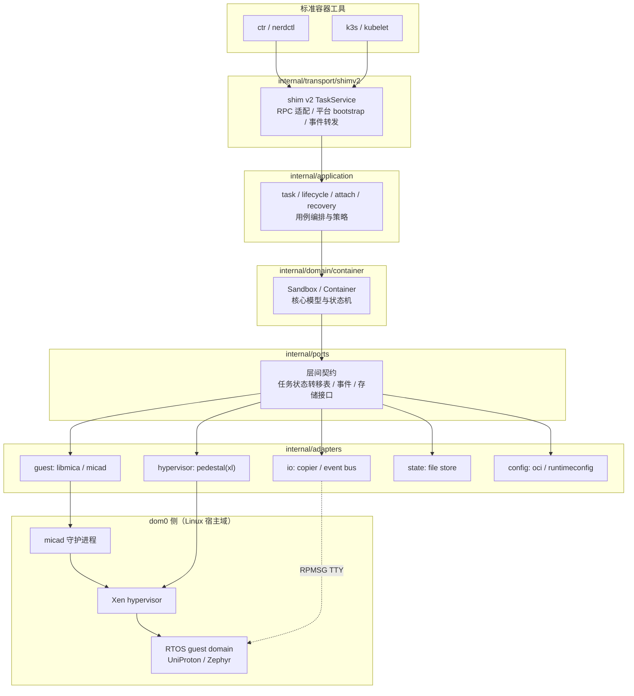
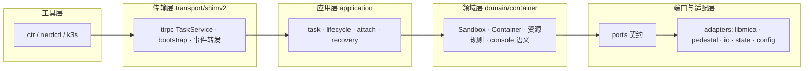
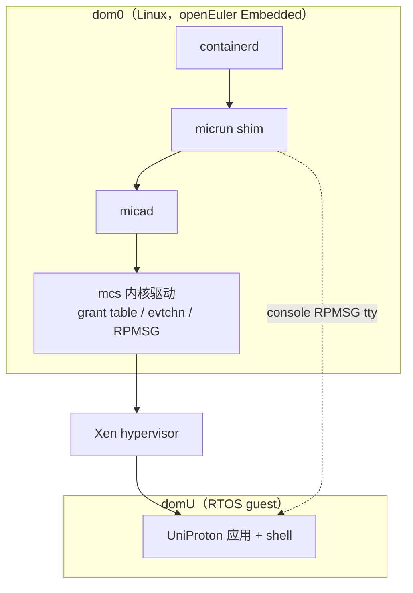
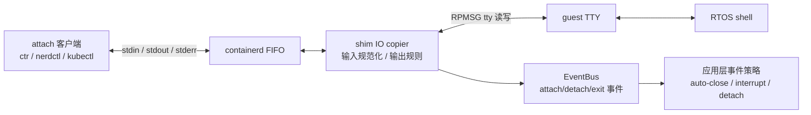
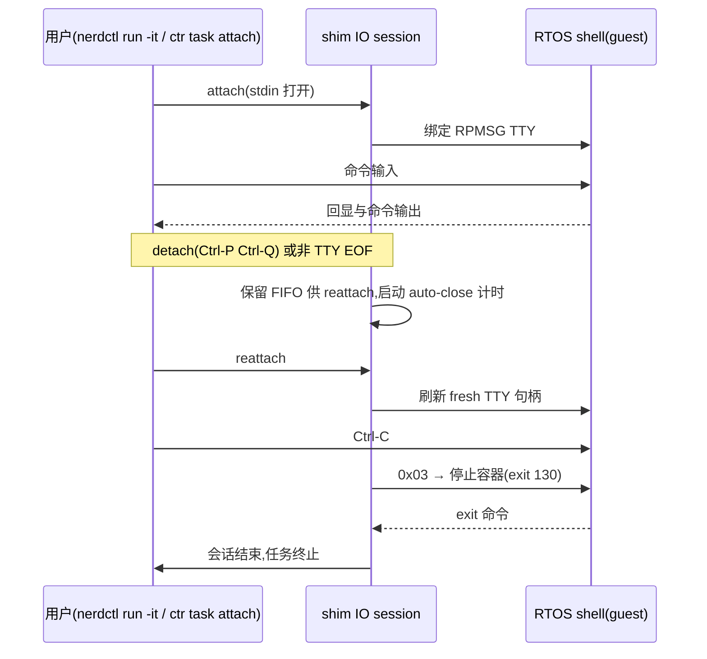
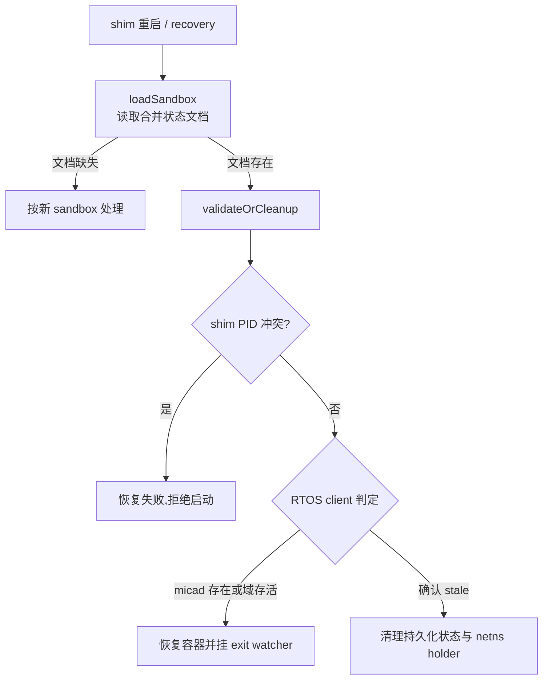
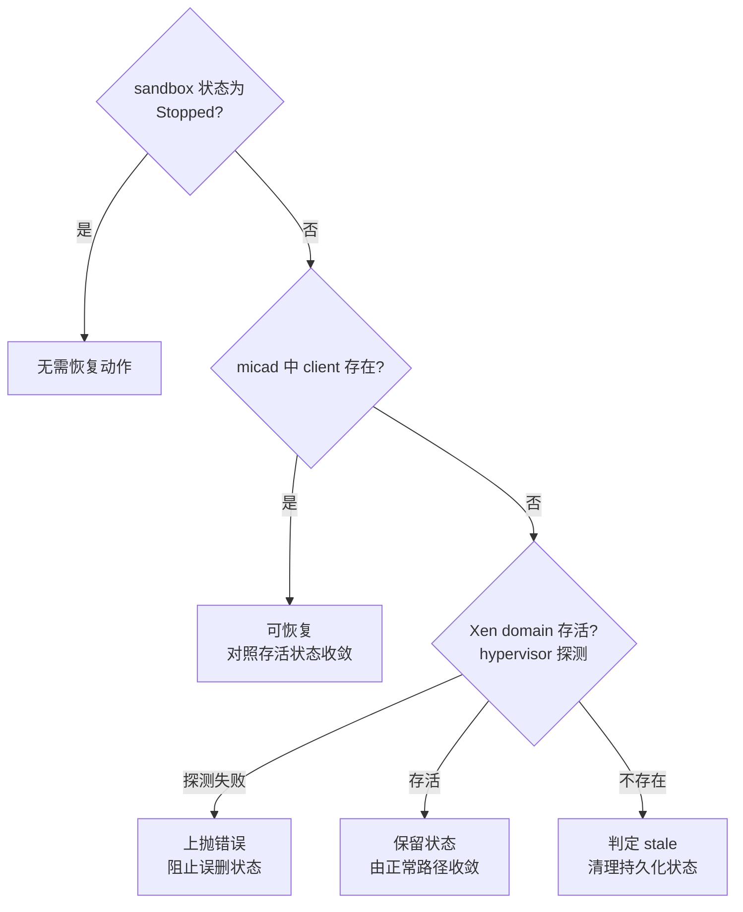
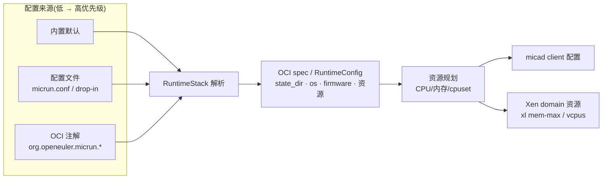

# MicRun 文档总览

本文档集面向两类读者：

- 使用者：如何部署、运行、排障、调优 MicRun
- 开发者：当前架构、关键接口、状态恢复、IO 与 pedestal 设计

## 建议阅读路径

### 初次接触 MicRun

1. [项目 README](../README.md)
2. [快速入门](quick-start.md)
3. [配置参考](reference/configuration.md)
4. [注解参考](reference/annotations.md)

### 想理解当前实现

0. [容器生命周期与 IO 会话语义](user/lifecycle-semantics.md)（停止/detach/auto-close/task 可见性的权威口径）
1. [架构设计](internals/architecture.md)
2. [目标架构](internals/target-architecture.md)
3. [状态管理](internals/state-management.md)
4. [IO 系统](internals/io-system.md)
5. [Pedestal 架构](internals/pedestal-architecture.md)
6. [并发模型](internals/concurrency.md)
7. [任务状态机](internals/task-state-machine.md)
8. [micad 控制协议](internals/micad-protocol.md)
9. [API 参考](reference/api-reference.md)

### 做问题排查或回归验证

1. [故障排查](user/troubleshooting.md)
2. [性能调优](user/performance-tuning.md)
3. [测试说明](../tests/README.md)
4. [测试体系（本地验证门/回归测试手册）](internals/testing.md)
5. [IO 测试](../tests/io/README.md)
6. [K3s 测试](../tests/k3s/README.md)

## 流程图速览

以下图示以 Mermaid 源码内嵌维护（各专题文档中的图示均链接至此）。

### 架构总览

对应文档：[架构设计](internals/architecture.md)

### 分层运行时

对应文档：[架构设计](internals/architecture.md)

### UniProton on Xen 主路径

对应文档：[架构设计](internals/architecture.md)

### IO 链路

对应文档：[IO 系统](internals/io-system.md)

### IO 交互细节

对应文档：[IO 系统](internals/io-system.md)

### 恢复与校验

对应文档：[Sandbox 校验](internals/sandbox-validation.md)

### 状态恢复决策

对应文档：[Sandbox 校验](internals/sandbox-validation.md)

### 配置与资源控制

对应文档：[架构设计](internals/architecture.md)

## 文档分区

### 用户文档

入口：[user/README.md](user/README.md)。

- [快速入门](quick-start.md)
- [Kubernetes 集成](user/kubernetes.md)
- [故障排查](user/troubleshooting.md)
- [性能调优](user/performance-tuning.md)

### 参考文档

- [参考文档入口](reference/README.md)
- [注解参考](reference/annotations.md)
- [配置参考](reference/configuration.md)
- [API 参考](reference/api-reference.md)
- [资源映射](reference/resources.md)

### 内部设计文档

入口：[internals/README.md](internals/README.md)（含阅读顺序）。

- 架构与状态：[架构设计](internals/architecture.md) · [目标架构](internals/target-architecture.md) · [Pedestal 架构](internals/pedestal-architecture.md) · [状态管理](internals/state-management.md) · [Sandbox 校验](internals/sandbox-validation.md)
- 行为契约：[并发模型](internals/concurrency.md) · [任务状态机](internals/task-state-machine.md) · [micad 协议](internals/micad-protocol.md) · [IO 系统](internals/io-system.md)
- 工程流程：[测试体系](internals/testing.md) · [贡献指南](internals/contribution-guide.md) · [可靠性架构](internals/reliability.md) · [日志系统](internals/logging.md)

## 当前文档状态

文档与代码保持同步。当前架构形态、已知边界与后续方向见
[架构设计的第 6/7 节](internals/architecture.md)。
