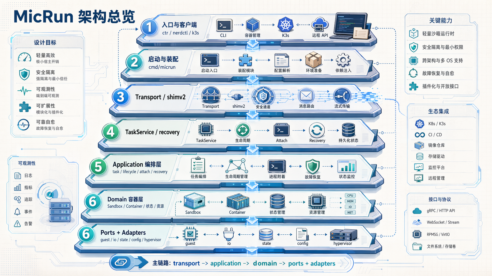
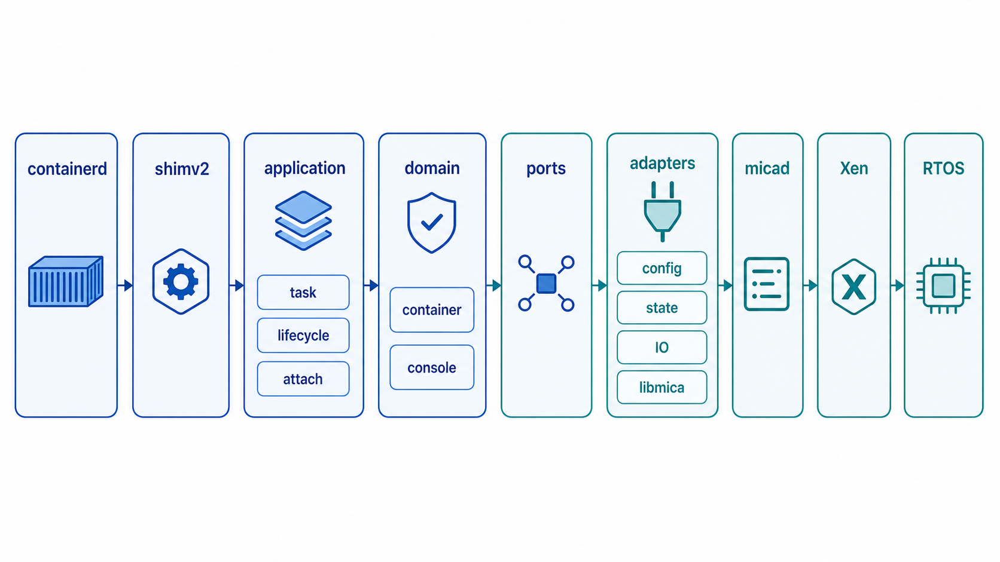
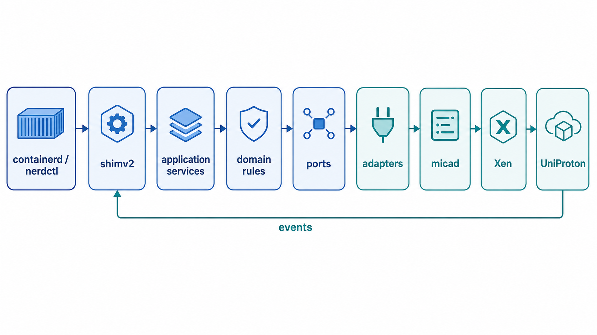
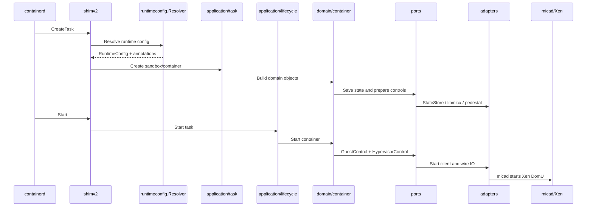
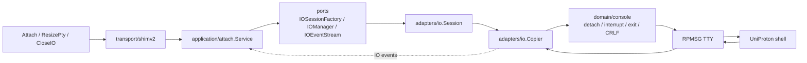
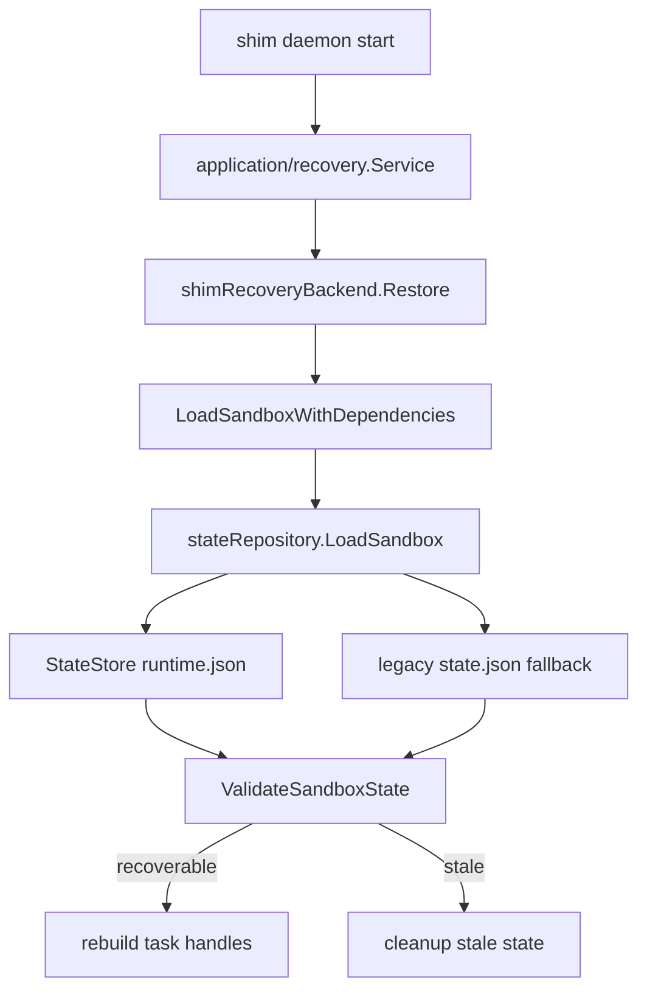
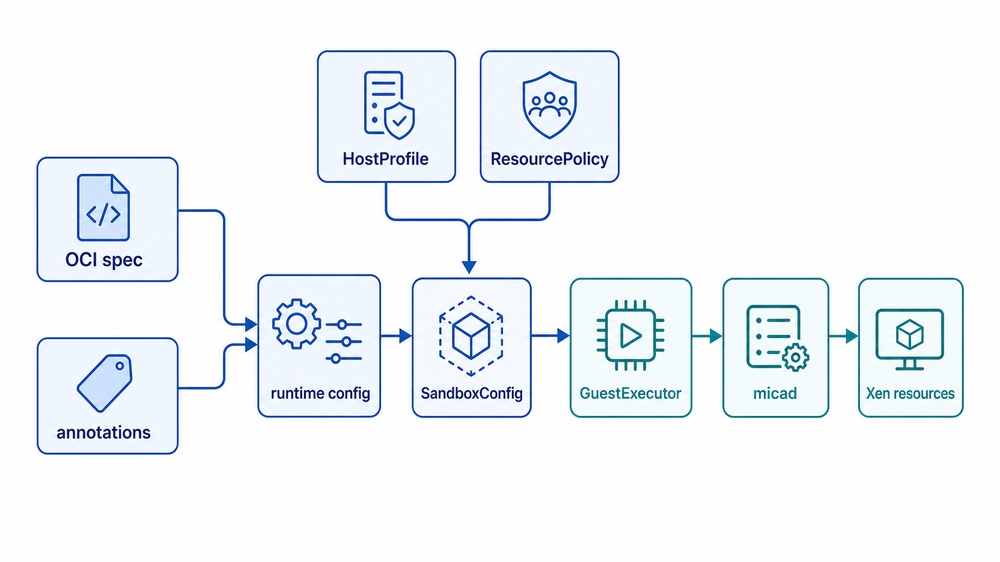

```mermaid
flowchart LR
  client["ctr / nerdctl / k3s"]
  containerd["containerd runtime v2"]
  bootstrap["main.go + bootstrap"]
  shimv2["transport/shimv2<br/>TaskService / one-shot / recovery"]
  runtime["application/runtime<br/>checked service graph"]
  task["application/task"]
  lifecycle["application/lifecycle"]
  attach["application/attach"]
  recovery["application/recovery"]
  domain["domain/container<br/>sandbox / container / state"]
  console["domain/console<br/>input and output rules"]
  ports["ports<br/>guest / hypervisor / state / IO / task"]
  adapters["adapters<br/>libmica / pedestal / state / config / IO"]
  micad["micad"]
  xen["Xen"]
  rtos["UniProton / Zephyr"]

  client --> containerd --> bootstrap --> shimv2 --> runtime
  runtime --> task --> domain
  runtime --> lifecycle --> domain
  runtime --> attach --> console
  runtime --> recovery --> domain
  domain --> ports --> adapters --> micad --> xen --> rtos
  rtos -. output and lifecycle events .-> attach
```

# MicRun 架构设计

本文档描述 MicRun 当前主干架构。这里以当前代码和本次重构复检结果为准，不再沿用早期 `pkg/shim`、`pkg/micantainer` 这类历史命名来描述当前实现。

## 1. 当前架构总览



下面的分层图用于帮助新开发者先建立“入口、编排、领域、端口、适配器”的整体位置感。



下面的图片用于快速理解 UniProton OCI workload 在 Xen 上的主路径。权威结构仍以本文的 Mermaid 图和代码路径说明为准。





```text
containerd / ctr / nerdctl / k3s
                 |
                 v
             main.go
  process bootstrap / early commands
                 |
                 v
  internal/transport/shimv2
 TaskService / one-shot / recovery entry
                 |
                 v
      internal/application
 runtime graph / task / lifecycle / attach / recovery
                 |
                 v
        internal/domain
 container / console / state / resource rules
                 |
                 v
          internal/ports
 GuestControl / HypervisorControl / StateStore /
 IOSessionFactory / IOManager / TaskRuntime
                 |
                 v
        internal/adapters
 guest/libmica / hypervisor/pedestal /
 state/file / config/{oci,runtimeconfig,configstack} / io
```

当前主干已经形成 `transport -> application -> domain -> ports/adapters` 的分层。和旧实现相比，最关键的变化有三点：

1. `shimv2` 不再单独吞掉配置、状态、attach、恢复四条主链路。
2. `StateStore` 已成为文件侧权威状态源，legacy `state.json` 只承担恢复兼容。
3. `HostProfile`、`ResourcePolicy`、`Dependencies` 已能从 transport 装配显式注入到创建和恢复链路。

### 1.1 本次重构复检结论

本次复检重点核对了代码路径和文档描述是否一致：

1. `internal/application/runtime` 是服务图装配入口，`attach`、`lifecycle`、`task`、`recovery` 通过 `NewServicesChecked` 建立并做引用一致性校验。
2. `internal/transport/shimv2` 仍是 containerd runtime-v2 边界，包名仍为 `shim`，但文档应以当前路径 `internal/transport/shimv2` 描述。
3. `application/task`、`application/lifecycle`、`application/attach` 已共享同一个 attach 服务实例，不再各自隐式构造。
4. `internal/domain/console` 承载输入语义和输出规范化，`internal/adapters/io` 只负责 FIFO、TTY、copier、epoll 和事件搬运。
5. 当前 git 跟踪的 `internal/adapters/io` 实现已经没有独立 `filter/`、`detector/` 子包；相关语义落在 `domain/console` 和 `adapters/io` 的具体文件中。
6. `internal/ports` 是跨层接口边界；`TaskRuntime` 已拆为 create/start/delete/query/wait/signal/io 等用例级复合接口。
7. `internal/adapters/config`、`guest/libmica`、`hypervisor/pedestal`、`state/file`、`io` 是当前基础设施适配点。

## 2. 分层职责

### 2.1 Bootstrap 与依赖装配

入口仍在 `main.go`。进程级启动逻辑已经拆到 `internal/bootstrap`：

- `bootstrap.Run` 协调 netns holder 命令、早期 `--help/--version` 命令和 shim daemon 启动
- `bootstrap/shimcli` 只负责 shim CLI 参数视图、二进制名推导、早期命令输出和日志上下文；早期命令只在 runtime-v2 `start/delete` action 之前识别，避免误处理 action 后的参数
- containerd runtime-v2 的 `BinaryOpts` 只在 bootstrap 层生成，避免 CLI 解析逻辑反向污染 transport 层

平台和运行时依赖装配仍在 `internal/transport/shimv2` 附近：

- `platform_bindings.go` 定义 `runtimeEnvironment` 和 `runtimeEnvironmentSource`，封装宿主平台探测结果
- `container_dependencies.go` 组装 `domain/container` 需要的显式依赖
- `runtime_dependencies.go` 组装运行时创建链路依赖

当前已经显式传递的关键对象包括：

- `HostProfile`
- `ResourcePolicy`
- `Dependencies`
- `GuestControl`
- `HypervisorControl`
- `StateStore`

### 2.2 Transport: `internal/transport/shimv2`

这一层仍然是 `containerd runtime v2` 语义边界，负责：

- shim daemon / one-shot 启动
- `TaskService` RPC 适配
- containerd 事件桥接
- 恢复入口和 runtime registry 重建
- 标准错误到 containerd 语义的映射

它现在仍然是系统的总入口，但已经不再适合继续承载更深的业务逻辑。

`taskManager` 只做 RPC 到 application task service 的适配。application 调用仍接收 `ports.TaskRuntime`，transport 自身的读写协作拆成独立视图：process 用于读取 shim PID，metrics 用于 `Stats`，task presence 用于 `Shutdown` 判断，events 用于 containerd 事件发布，shutdown 用于 daemon 退出副作用。`taskManagerDepsFromShimService` 是 shim daemon 把这些视图组装给 `taskManager` 的唯一生产入口，缺服务或缺端口会在构造阶段失败。

### 2.3 Application: `internal/application/*`

应用层目前已经按链路拆分：

- `runtime`: 统一装配 task/lifecycle/attach/recovery 服务图，并校验服务图完整性与内部引用一致性
- `task`: create/delete 等任务级编排
- `lifecycle`: start/stop/wait 运行时编排
- `attach`: attach/detach/resize/stdin-close 语义
- `recovery`: 恢复与重建 registry

这一层的职责是把 `containerd` 请求翻译成 MicRun 内部动作序列，而不是直接操作底层文件、TTY 或 micad socket。`application/runtime` 固定了 attach/lifecycle/task 共享同一个 attach 服务实例，并通过 `NewServicesChecked` 做一次完整性和引用一致性校验。`application/lifecycle` 只接受显式注入的 attach 服务，`application/task` 只接受成对注入的 attach/lifecycle 服务；缺依赖或半注入会直接返回错误，不再回退到包内默认共享构造，避免 task 和 lifecycle 分别持有不同 attach 实例。

`runtime.Options` 是这一层的单一装配入口，负责把 `IOSessionFactory` 和共享 `Clock` 送进服务图；上层不应再分别为 attach、lifecycle、task 分别组装依赖。

### 2.4 Domain: `internal/domain`

当前领域层以 `container` 为主体，并开始按规则类型拆出子域：

- `Sandbox` / `Container` 聚合
- 状态机与状态转换规则
- 资源解析和资源校验
- 运行时状态快照的装载与落盘编排
- `console.InputInterpreter` 解释 TTY/non-TTY 用户输入语义

领域层已完成依赖注入纯化：`Dependencies` 通过 `SandboxConfig` 显式传入，不再使用包级全局状态。

### 2.5 Ports: `internal/ports`

ports 是应用层与基础设施之间的稳定边界。当前重点接口包括：

- `GuestControl`: guest 生命周期与状态
- `GuestExecutor`: 资源管理复合接口，由三个子接口组成：
  - `GuestResourceReader`: 读取当前资源状态（`ReadResource`、`CurrentMaxMem`、`MemoryThresholdMB`）
  - `GuestResourceUpdater`: 应用资源变更（`UpdateCPUCapacity`、`UpdateCPUWeight`、`UpdateVCPUNum`、`UpdatePCPUConstraints`、`EnsureMemoryLimit`、`UpdateMemoryThreshold`、`UpdateMemory`、`RecordMemoryState`、`VCPUPin`）
  - `GuestResourceDiff`: 检查是否需要更新（`NeedUpdateCPUCap`、`NeedUpdateMemLimit`、`NeedUpdateCPUSet`、`NeedUpdateCPUShare`、`NeedUpdateVCPUs`）
- `ResourceSnapshot`: guest 资源状态快照（`CPUCapacity`、`CPUWeight`、`ClientCPUSet`、`VCPU`、`MemoryMaxMB`）
- `HypervisorControl`: 宿主/hypervisor 控制面
- `StateStore`: 运行时快照持久化
- `IOSessionFactory` / `IOEventStream` / `IOManager`: IO 会话管理
- `TaskRuntime`: task 级运行时接口，由 `TaskLocker`、`TaskIdentity`、`TaskStore`、`TaskFactory`、`TaskSandboxAccess`、`TaskStatusOps` 组合；application/task 对外按 create/start/delete/query/wait/signal/io 使用更窄的复合接口
- `RecoveryBackend`: 恢复后端

这条边界的意义是让 `application` 不再直接绑定 `libmica`、`pedestal`、`state/file`、`adapters/io` 的具体实现。

### 2.6 Adapters: `internal/adapters/*`

当前适配层已经按外部系统拆开：

- `guest/libmica`: micad 协议、控制、状态、socket
- `hypervisor/pedestal`: Xen/pedestal 能力适配
- `state/file`: 文件快照存储
- `config/oci`、`config/runtimeconfig`、`config/configstack`: 配置解析和叠加
- `io`: FIFO、TTY、copier、event bus、session

这比旧的“大包直连”结构清晰得多，但适配层内部仍有进一步收敛空间。

## 3. 三条关键主链路

### 3.1 创建与启动链路



```text
CreateTaskRequest
  -> transport/shimv2
  -> runtimeconfig.Resolver
  -> oci.ParseContainerCfg
  -> application/task + application/lifecycle
  -> domain/container.{CreateSandbox,CreateContainer,Start}
  -> ports.{GuestControl,HypervisorControl,StateStore}
```

当前创建链路的关键改进：

1. `RuntimeConfig` 必须显式解析后再传入 `oci.ParseContainerCfg`
2. `oci` 配置适配层已经移除无参 `NewRuntimeConfig` / `NewRuntimeStack`，`HostProfile` 必须显式传入，不再从包内偷偷回退 `pedestal.Host`
3. `ResourcePolicy` 由 shim 装配后显式注入，不再只能走包级默认入口
4. `SandboxConfig` 必须带上 `Dependencies`，`newSandbox` 要求非空依赖

### 3.2 Attach 与 IO 链路



```text
ResizePty / Attach / CloseIO
  -> transport/shimv2
  -> application/attach.Service
  -> ports.{IOSessionFactory, IOEventStream, IOManager}
  -> adapters/io
  -> domain/console.InputInterpreter
  -> RPMSG TTY
```

当前 attach 语义已经上收到 `application/attach`：

- 是否允许 attach
- 首连还是重连
- detach 后是否保留 FIFO
- resize 是否重启底层 session
- stdin close 后的行为

底层 `adapters/io` 现在主要负责“怎么传”；`domain/console` 负责把字节解释成
detach、interrupt、exit、TTY 写入、local echo 等动作。

### 3.3 恢复链路



```text
shim daemon start
  -> application/recovery.Service
  -> shimRecoveryBackend.Restore
  -> domain/container.LoadSandboxWithDependencies
  -> stateRepository.LoadSandbox
  -> ValidateSandboxState
  -> rebuild recovered task handles
```

当前恢复逻辑已经有了比较清晰的责任分工：

1. `RecoveryBackend` 负责把 shim 恢复请求翻译成领域恢复
2. `stateRepository` 负责优先从 `StateStore` 读取，再回退 legacy `state.json`
3. `ValidateSandboxState` 负责校验 shim PID、guest 是否存在、guest 状态是否可恢复
4. 恢复成功后由 transport 层重建 task registry

## 4. 状态架构

当前权威状态存储已经收敛到 `internal/adapters/state/file.Store`，根目录默认为 `/run/micrun`。

### 4.1 当前权威路径

- sandbox snapshot: `/run/micrun/runtime/sandbox/<sandbox-id>/runtime.json`
- container snapshot: `/run/micrun/runtime/container/<container-path-or-id>/runtime.json`

其中 container snapshot 的 key 优先使用 `containerPath`，如果拿不到有效路径才回退到 `containerID`。

### 4.2 兼容路径

以下路径仍会在恢复时读取，但不再是主写入目标：

- `/run/micrun/sandbox/<sandbox-id>/state.json`
- `/run/micrun/<container-path>/state.json`
- `/run/micrun/<container-id>/state.json`

当前策略是：

1. 新状态只写 `runtime.json`
2. 恢复优先读 `runtime.json`
3. 如果只找到 legacy `state.json`，则读入后迁移到 `runtime.json`

这意味着 bundle 内部状态文件和旧目录结构都已经退出“权威源”角色。

## 5. 配置与资源解析

当前 `RuntimeConfig` 的解析顺序以 `internal/adapters/config/runtimeconfig/resolver.go` 为准：



1. 如果调用方已经传入 `current *RuntimeConfig`，直接复用
2. 注解中的 sandbox config path
3. CRI runtime options 里的 `ConfigPath`
4. 环境变量 `MICRUN_CONF_FILE`
5. 自动发现配置文件集合：
   - `MICRUN_CONF_DIR`
   - `/etc/mica/micrun/conf.d/*.conf|*.toml`
   - `/etc/mica/micrun/micrun.conf`
6. 最后统一叠加 annotations

需要注意两点：

1. 环境变量在当前实现里主要用于“选择配置文件来源”，不是直接承载 workload 值。
2. 注解是最终 overlay，而不是简单地和环境变量并列比较优先级。

资源链路当前也比旧实现更明确：

- 宿主画像通过 `HostProfile` 注入
- 资源规划策略通过 `ResourcePolicy` 注入
- `cpuset` 归一化与越界 CPU 过滤在 `domain/container` 本地完成

## 6. 当前架构的优点

截至当前版本，MicRun 架构已经具备以下优点：

1. 主干分层已成型，transport/application/domain 不再完全混在一起。
2. 状态恢复开始围绕 `StateStore` 组织，不再依赖多处文件猜测权威源。
3. 创建与恢复链路都支持显式 `Dependencies`，对包级单例的依赖面明显缩小。
4. 配置解析顺序已经可被文档和代码同时解释，`oci` 适配层不再保留隐式宿主默认值入口。
5. `shimv2` 的平台 bootstrap 已收敛为"默认来源 -> 绑定结果"的两段式装配，结果以 `runtimeEnvironment` 命名类型承载，测试可以构造显式绑定结果，不必强依赖全局平台单例。
6. attach 语义已从纯 IO adapter 中上提，detach/interrupt/exit/stdin-close 都通过应用层事件策略处理，终端 reattach 会刷新 guest TTY。
7. `guestmicad` / `pedestal` 的包级默认 control 入口已经移除，guest/hypervisor 适配器都改为显式绑定。
8. pedestal 资源规划、client CPU 计算、hugepage 判断已经改为基于绑定后的 `PedestalFacade` 能力进入主路径。
9. IO EventBus 对外暴露只读订阅通道，发布和关闭所有权留在 adapter 内部。
10. fd 提取、typed-nil 判断、fresh TTY 关闭语义已收敛到可复用 support/helper 和专门测试。

## 7. 当前仍待收敛的点

现有架构已经可维护，但还没有达到"没有进一步优化空间"的程度。主要残留问题如下：

1. ~~`domain/container` 仍保留 `globalDeps` 兼容入口~~ 已完全移除，所有依赖通过 `SandboxConfig.Dependencies` 显式注入，`newSandbox` 要求非空依赖。
2. `pedestal.Host` / `InitHost()` 全局入口已删除，guest/hypervisor control、资源规划、client CPU 计算、hugepage 判断都不再依赖包级默认对象；host 检测结果已沉淀为 `runtimeEnvironment` 命名类型。
3. 资源规划还没有独立成真正的 `resource` 子域，部分规则仍散落在 domain 和 adapter 之间。
4. IO 输入与输出规范化已经从 `adapters/io.Copier` 上提到 `internal/domain/console`；session restart 已改为候选 copier 启动成功后再提交，剩余可继续观察的是 echo 抑制是否值得独立成更小的输出策略。
5. `libmica` 协议响应模型已通过 `MicaUpdateRequest` 结构化，减少资源更新时的字符串散落。

## 8. 结论

MicRun 当前架构已经从"单体 shim 逻辑"演进为"以 shimv2 为入口、以 application 为编排、以 domain/container 为核心、以 ports/adapters 为边界"的稳定结构。

已完成的架构改进：

1. ✅ `globalDeps` 服务定位器完全移除，所有依赖显式注入
2. ✅ `GuestExecutor` 按 Interface Segregation Principle 拆分为 Reader/Updater/Diff 三个子接口
3. ✅ Go 命名规范标准化（CPU/VCPU/ID），跨 domain/ports/adapters 一致化
4. ✅ 死代码全面清理（sandboxResource 6 个方法/字段、UpdateSandboxPoolVCPUs、dummySandboxConfig）
5. ✅ `TaskRuntime` 拆分为基础能力接口，并为 create/start/delete/query/wait/signal/io 建立用例级复合接口
6. ✅ `adapters/io` 提取 `epollWaiter` 独立类型，当前跟踪代码不再使用独立 `filter/`、`detector/` 子包
7. ✅ `libmica` 协议结构化（`MicaUpdateRequest` + `Filter` 类型）
8. ✅ `platformBindings` 重命名为 `runtimeEnvironment`，host 检测结果沉淀为命名类型
9. ✅ lifecycle 的 task context 收敛为 application/lifecycle 内部实现细节，ports 只保留跨层能力接口
10. ✅ 命名一致性优化（`GetCopier()` → `Copier()`，错误链 `%v` → `%w`）
11. ✅ `internal/domain/console` 输入语义状态机落地，`Copier` 不再承载 exit/detach/interrupt/CRLF/backspace 规则
12. ✅ `internal/domain/console` 输出规范化状态机落地，NUL 过滤和连续换行压缩支持跨 read chunk
13. ✅ attach reattach 支持 fresh TTY 句柄刷新，避免 detach 后复用 stale TTY
14. ✅ IO session restart 具备失败原子性：先启动候选 copier，成功后再提交 session 状态
15. ✅ fd/typed-nil 资源识别下沉到 support，IO 和 attach 共享底层判断

下一阶段最值得继续推进的方向：

1. 把资源规划从 `domain/container` 继续抽成更清晰的子域边界
2. 继续评估 `Copier` 中 echo 抑制是否需要独立为输出策略，避免 copier 再次累积交互语义
