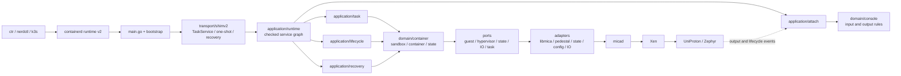

# MicRun 架构设计

本文档描述 MicRun 主干架构，以当前代码为准。

## 1. 当前架构总览

先建立“入口、编排、领域、端口、适配器”的整体位置感：
[架构总览](../README.md#架构总览) · [分层运行时](../README.md#分层运行时) ·
[UniProton on Xen 主路径](../README.md#uniproton-on-xen-主路径)。


```mermaid
flowchart LR
  client["ctr / nerdctl / k3s"]
  containerd["containerd runtime v2"]
  bootstrap["main.go + bootstrap"]
  shimv2["transport/shimv2<br/>TaskService / one-shot / recovery"]
  runtime["application/runtime<br/>checked service graph"]
  task["application/task"]
  lifecycle["application/lifecycle"]
  attach["application/attach"]
  recovery["application/recovery"]
  domain["domain/container<br/>sandbox / container / state"]
  console["domain/console<br/>input and output rules"]
  ports["ports<br/>guest / hypervisor / state / IO / task"]
  adapters["adapters<br/>libmica / pedestal / state / config / IO"]
  micad["micad"]
  xen["Xen"]
  rtos["UniProton / Zephyr"]

  client --> containerd --> bootstrap --> shimv2 --> runtime
  runtime --> task --> domain
  runtime --> lifecycle --> domain
  runtime --> attach --> console
  runtime --> recovery --> domain
  domain --> ports --> adapters --> micad --> xen --> rtos
  rtos -. output and lifecycle events .-> attach
```

```text
containerd / ctr / nerdctl / k3s
                 |
                 v
             main.go
  process bootstrap / early commands
                 |
                 v
  internal/transport/shimv2
 TaskService / one-shot / recovery entry
                 |
                 v
      internal/application
 runtime graph / task / lifecycle / attach / recovery
                 |
                 v
        internal/domain
 container / console / state / resource rules
                 |
                 v
          internal/ports
 GuestControl / HypervisorControl / StateStore /
 IOSessionFactory / IOManager / TaskRuntime
                 |
                 v
        internal/adapters
 guest/libmica / hypervisor/pedestal /
 state/file / config/{oci,runtimeconfig,configstack} / io
```

主干分层为 `transport -> application -> domain -> ports/adapters`，其中三个关键点：

1. `shimv2` 不承载配置、状态、attach、恢复四条主链路的业务逻辑。
2. `StateStore` 已成为文件侧权威状态源，legacy `state.json` 只承担恢复兼容。
3. `HostProfile`、`ResourcePolicy`、`Dependencies` 已能从 transport 装配显式注入到创建和恢复链路。

### 1.1 实现对照要点

以下事实已逐条对照代码路径核实：

1. `internal/application/runtime` 是服务图装配入口，`attach`、`lifecycle`、`task`、`recovery` 通过 `NewServicesChecked` 建立并做引用一致性校验。
2. `internal/transport/shimv2` 仍是 containerd runtime-v2 边界，包名仍为 `shim`，但文档应以当前路径 `internal/transport/shimv2` 描述。
3. `application/task`、`application/lifecycle`、`application/attach` 共享同一个 attach 服务实例。
4. `internal/domain/console` 承载输入语义和输出规范化，`internal/adapters/io` 只负责 FIFO、TTY、copier、epoll 和事件搬运。
5. `internal/adapters/io` 无独立 `filter/`、`detector/` 子包；相关语义落在 `domain/console` 和 `adapters/io` 的具体文件中。
6. `internal/ports` 是跨层接口边界；`TaskRuntime` 已拆为 create/start/delete/query/wait/signal/io 等用例级复合接口。
7. `internal/adapters/config`、`guest/libmica`、`hypervisor/pedestal`、`state/file`、`io` 是当前基础设施适配点。

## 2. 分层职责

### 2.1 Bootstrap 与依赖装配

入口在 `main.go`，进程级启动逻辑位于 `internal/bootstrap`：

- `bootstrap.Run` 协调 netns holder 命令、早期 `--help/--version` 命令和 shim daemon 启动
- `bootstrap/shimcli` 只负责 shim CLI 参数视图、二进制名推导、早期命令输出和日志上下文；早期命令只在 runtime-v2 `start/delete` action 之前识别，避免误处理 action 后的参数
- containerd runtime-v2 的 `BinaryOpts` 只在 bootstrap 层生成，避免 CLI 解析逻辑反向污染 transport 层

平台和运行时依赖装配仍在 `internal/transport/shimv2` 附近：

- `platform_bindings.go` 定义 `runtimeEnvironment` 和 `runtimeEnvironmentSource`，封装宿主平台探测结果
- `container_dependencies.go` 组装 `domain/container` 需要的显式依赖
- `runtime_dependencies.go` 组装运行时创建链路依赖

显式传递的关键对象包括：

- `HostProfile`
- `ResourcePolicy`
- `Dependencies`
- `GuestControl`
- `HypervisorControl`
- `StateStore`

### 2.2 Transport: `internal/transport/shimv2`

这一层仍然是 `containerd runtime v2` 语义边界，负责：

- shim daemon / one-shot 启动
- `TaskService` RPC 适配
- containerd 事件桥接
- 恢复入口和 runtime registry 重建
- 标准错误到 containerd 语义的映射

它是系统的总入口，不承载深层业务逻辑。

`taskManager` 只做 RPC 到 application task service 的适配。application 调用仍接收 `ports.TaskRuntime`，transport 自身的读写协作拆成独立视图：process 用于读取 shim PID，metrics 用于 `Stats`，task presence 用于 `Shutdown` 判断，events 用于 containerd 事件发布，shutdown 用于 daemon 退出副作用。`taskManagerDepsFromShimService` 是 shim daemon 把这些视图组装给 `taskManager` 的唯一生产入口，缺服务或缺端口会在构造阶段失败。

### 2.3 Application: `internal/application/*`

应用层按链路拆分：

- `runtime`: 统一装配 task/lifecycle/attach/recovery 服务图，并校验服务图完整性与内部引用一致性
- `task`: create/delete 等任务级编排
- `lifecycle`: start/stop/wait 运行时编排
- `attach`: attach/detach/resize/stdin-close 语义
- `recovery`: 恢复与重建 registry
- `exitstatus`: 退出码契约（信号映射、fabricated exit 语义）

这一层的职责是把 `containerd` 请求翻译成 MicRun 内部动作序列，而不是直接操作底层文件、TTY 或 micad socket。`application/runtime` 固定了 attach/lifecycle/task 共享同一个 attach 服务实例，并通过 `NewServicesChecked` 做一次完整性和引用一致性校验。`application/lifecycle` 只接受显式注入的 attach 服务，`application/task` 只接受成对注入的 attach/lifecycle 服务；缺依赖或半注入会直接返回错误，避免 task 和 lifecycle 分别持有不同 attach 实例。

`runtime.Options` 是这一层的单一装配入口，负责把 `IOSessionFactory` 和共享 `Clock` 送进服务图；上层不应再分别为 attach、lifecycle、task 分别组装依赖。

### 2.4 Domain: `internal/domain`

当前领域层以 `container` 为主体，并开始按规则类型拆出子域：

- `Sandbox` / `Container` 聚合
- 状态机与状态转换规则
- 资源解析和资源校验
- 运行时状态快照的装载与落盘编排
- `console.InputInterpreter` 解释 TTY/non-TTY 用户输入语义

领域层依赖注入纯化：`Dependencies` 通过 `SandboxConfig` 显式传入，不使用包级全局状态。

### 2.5 Ports: `internal/ports`

ports 是应用层与基础设施之间的稳定边界。当前重点接口包括：

- `GuestControl`: guest 生命周期与状态
- `GuestExecutor`: 资源管理复合接口，由四个子接口组成：
  - `GuestResourceReader`: 读取当前资源状态（`ReadResource`、`CurrentMaxMem`、`MemoryThresholdMB`）
  - `GuestResourceUpdater`: 应用资源变更（`UpdateCPUCapacity`、`UpdateCPUWeight`、`UpdateVCPUNum`、`RecordVCPUCount`、`UpdatePCPUConstraints`、`EnsureMemoryLimit`、`UpdateMemoryThreshold`、`UpdateMemory`、`RecordMemoryState`、`VCPUPin`）
  - `GuestResourceDiff`: 检查纯本地增量是否需要更新（`NeedUpdateMemLimit`、`NeedUpdateCPUSet`、`NeedUpdateCPUWeight`）
  - `GuestResourceCapacityDiff`: 检查可能需要宿主上限参与判定的增量（`NeedUpdateCPUCap`、`NeedUpdateVCPUs`）
- `ResourceSnapshot`: guest 资源状态快照（`CPUCapacity`、`CPUWeight`、`ClientCPUSet`、`VCPU`、`MemoryMaxMB`）
- `HypervisorControl`: 宿主/hypervisor 控制面
- `StateStore`: 运行时快照持久化
- `IOSessionFactory` / `IOEventStream` / `IOManager`: IO 会话管理
- `TaskRuntime`: task 级运行时接口，由 `TaskLocker`、`TaskIdentity`、`TaskStore`、`TaskFactory`、`TaskSandboxAccess`、`TaskStatusOps` 组合；application/task 对外按 create/start/delete/query/wait/signal/io 使用更窄的复合接口
- `RecoveryBackend`: 恢复后端

这条边界的意义是让 `application` 不直接绑定 `libmica`、`pedestal`、`state/file`、`adapters/io` 的具体实现。

### 2.6 Adapters: `internal/adapters/*`

适配层按外部系统拆开：

- `guest/libmica`、`guest/micad`: micad 协议、控制、状态、socket
- `hypervisor/pedestal`: Xen/pedestal 能力适配
- `state/file`: 文件快照存储
- `config/oci`、`config/runtimeconfig`、`config/configstack`: 配置解析和叠加
- `io`: FIFO、TTY、copier、event bus、session

适配层内部仍有进一步收敛空间。

## 3. 三条关键主链路

### 3.1 创建与启动链路

（流程图见 [文档总览·流程图速览](../README.md#流程图速览)的创建与启动时序图）

```text
CreateTaskRequest
  -> transport/shimv2
  -> runtimeconfig.Resolver
  -> oci.ParseContainerCfg
  -> application/task + application/lifecycle
  -> domain/container.{CreateSandbox,CreateContainer,Start}
  -> ports.{GuestControl,HypervisorControl,StateStore}
```

当前创建链路的关键约束：

1. `RuntimeConfig` 必须显式解析后再传入 `oci.ParseContainerCfg`
2. `oci` 配置适配层不提供无参 `NewRuntimeConfig` / `NewRuntimeStack`，`HostProfile` 必须显式传入，不从包内回退 `pedestal.Host`
3. `ResourcePolicy` 由 shim 装配后显式注入，不依赖包级默认入口
4. `SandboxConfig` 必须带上 `Dependencies`，`newSandbox` 要求非空依赖

### 3.2 Attach 与 IO 链路

（流程图见 [文档总览·流程图速览](../README.md#流程图速览)的 IO 链路图）

```text
ResizePty / Attach / CloseIO
  -> transport/shimv2
  -> application/attach.Service
  -> ports.{IOSessionFactory, IOEventStream, IOManager}
  -> adapters/io
  -> domain/console.InputInterpreter
  -> RPMSG TTY
```

attach 语义上收到 `application/attach`：

- 是否允许 attach
- 首连还是重连
- detach 后是否保留 FIFO
- resize 是否重启底层 session
- stdin close 后的行为

底层 `adapters/io` 现在主要负责“怎么传”；`domain/console` 负责把字节解释成
detach、interrupt、exit、TTY 写入、local echo 等动作。

### 3.3 恢复链路

（流程图见 [文档总览·流程图速览](../README.md#流程图速览)的恢复与校验图）

```text
shim daemon start
  -> application/recovery.Service
  -> shimRecoveryBackend.Restore
  -> domain/container.LoadSandboxWithDependencies
  -> stateRepository.LoadSandbox
  -> ValidateSandboxState
  -> rebuild recovered task handles
```

恢复逻辑的责任分工：

1. `RecoveryBackend` 负责把 shim 恢复请求翻译成领域恢复
2. `stateRepository` 负责优先从 `StateStore` 读取，再回退 legacy `state.json`
3. `ValidateSandboxState` 负责校验 shim PID、guest 是否存在、guest 状态是否可恢复
4. 恢复成功后由 transport 层重建 task registry

## 4. 状态架构

权威状态存储收敛于 `internal/adapters/state/file.Store`（根目录默认 `/run/micrun`）：
一个 sandbox 的全部持久化状态收敛为**一个原子写入的合并文档**
（`/run/micrun/runtime/sandbox/<id>/runtime.json`，携带 sandbox 与全部容器状态），
配合三层恢复回退（合并文档 → 旧格式每容器快照 → legacy `state.json`）。

文档模型的结构性保证（原子写/删除即缺席/恢复一次性消费）、兼容路径清单与
恢复链路的完整说明，见[状态管理](state-management.md)（权威）。

## 5. 配置与资源解析

`RuntimeConfig` 的六层解析顺序（传入实例 → 注解 config path → CRI options →
环境变量 → 自动发现 → annotations overlay）与 INI/TOML 文件格式，见
[配置参考](../reference/configuration.md)（权威）；CPU/内存/cpuset 的资源映射
与归一化规则见[资源映射](../reference/resources.md)。架构侧只强调两条原则：

1. 环境变量用于"选择配置文件来源"，不直接承载 workload 值；
2. 注解是最终 overlay，而非与环境变量并列比较优先级。

## 6. 架构特性

主干按 transport → application → domain → ports → adapters 分层，当前形态的关键事实：

1. 分层清晰：transport/application/domain 职责不混淆，RPC 适配、用例编排、核心模型各居其位。
2. 状态以 `StateStore` 为单一权威源组织，恢复不需要多处文件猜测。
3. 创建与恢复链路均通过显式 `Dependencies` 注入，无包级单例依赖。
4. 配置解析顺序（内置默认 → 配置文件 → OCI 注解）可被文档与代码同时解释，`oci` 适配层无隐式宿主默认值入口。
5. shimv2 平台 bootstrap 为"默认来源 → 绑定结果"两段式装配，结果承载于 `runtimeEnvironment` 命名类型，测试可构造显式绑定。
6. attach 语义在应用层事件策略中处理（detach/interrupt/exit/stdin-close），终端 reattach 会刷新 guest TTY。
7. guest/hypervisor 适配器均显式绑定，无包级默认 control 入口。
8. pedestal 资源规划、client CPU 计算、hugepage 判断基于绑定后的 `PedestalFacade` 能力进入主路径。
9. IO EventBus 对外只暴露只读订阅通道，发布与关闭所有权留在 adapter 内部。
10. fd 提取、typed-nil 判断、fresh TTY 关闭语义收敛在可复用 support/helper 并有专门测试。

## 7. 已知边界与后续方向

架构已可维护，但存在如下已知边界：

1. 资源规划尚未独立成 `resource` 子域，部分规则仍散落在 domain 与 adapter 之间。
2. `adapters/io` 的输入与输出规范化已上提到 `internal/domain/console`；echo 抑制仍留在 copier 内，是否独立为更小的输出策略待观察。

后续推进方向：

1. 把资源规划从 `domain/container` 抽成更清晰的子域边界。
2. 评估 echo 抑制独立化，避免 copier 再次累积交互语义。
