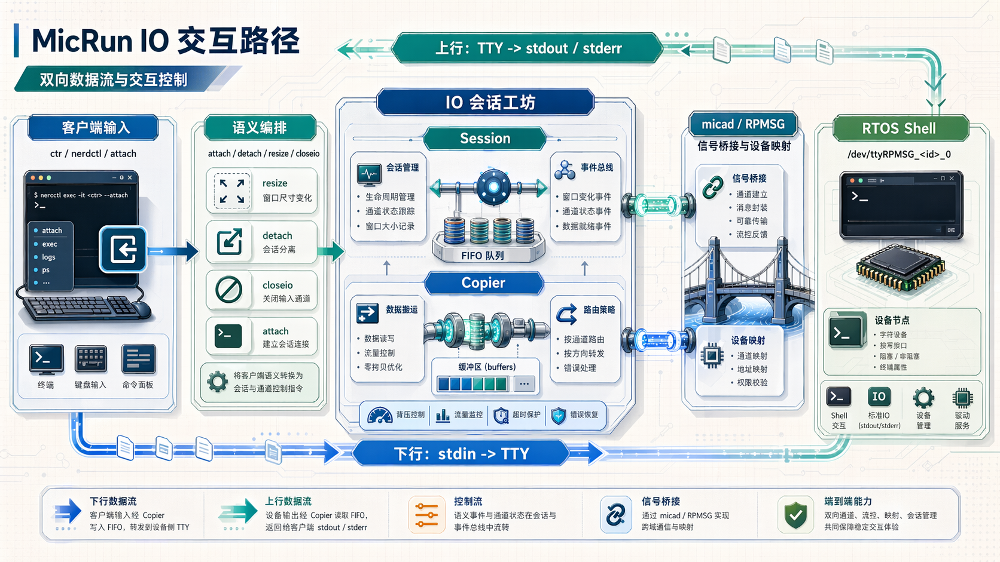
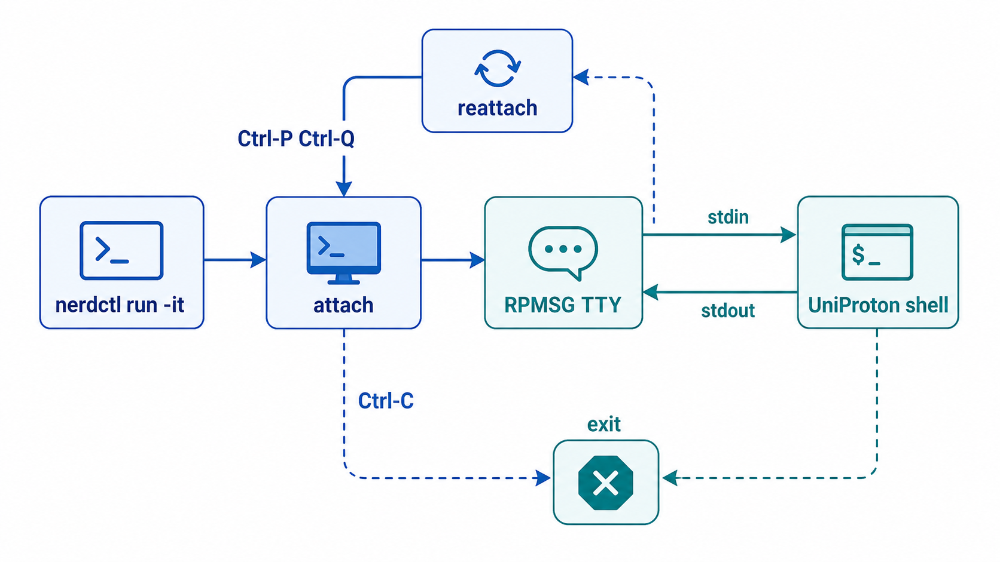
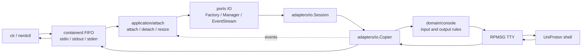
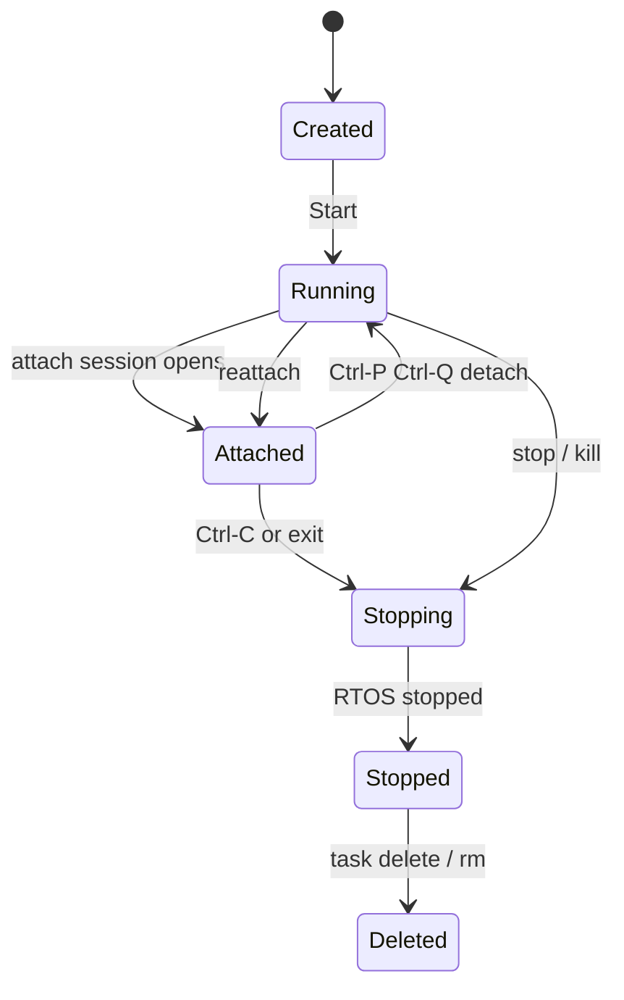

# MicRun IO 系统设计文档

## 概述

本文档描述 MicRun 的 IO 系统，用于处理 RTOS 容器的双向数据传输（containerd FIFO ↔ RPMSG TTY）。

## 架构



下面的交互图突出 `nerdctl run -it`、attach、detach、reattach、`Ctrl-C` 和 `exit` 在同一条 UniProton shell 路径上的关系。



下面的 Mermaid 图是当前 IO 主路径的可编辑版本。PNG 用于快速浏览，Mermaid 用于代码评审时检查路径是否仍和实现一致。



```
┌─────────────────────────────────────────────────────────────┐
│                   containerd (ctr/nerdctl)                  │
│   ┌───────────┐  ┌───────────┐  ┌───────────────────┐       │
│   │ CreateTask│  │   Start   │  │     Attach        │       │
│   └─────┬─────┘  └─────┬─────┘  └─────────┬─────────┘       │
└─────────┼──────────────┼──────────────────┼─────────────────┘
          │              │    FIFO (stdio)  │
          └──────────────┴──────────────────┬┘
                                           ▼
┌─────────────────────────────────────────────────────────────┐
│                     MicRun Shim                             │
│  ┌───────────────────────────────────────────────────────┐  │
│  │            internal/application/attach               │  │
│  │  • attach / reattach orchestration                   │  │
│  │  • resize / stdin-close / detach semantics           │  │
│  └───────────────────────────────────────────────────────┘  │
│                            │                                │
│  ┌───────────────────────────────────────────────────────┐  │
│  │                 internal/adapters/io                 │  │
│  │  ┌──────────┐  ┌──────────┐  ┌───────────────────┐    │  │
│  │  │ Session  │  │  Copier  │  │     EventBus      │    │  │
│  │  │ • FIFO   │  │ • copy   │  │ • pub/sub         │    │  │
│  │  │ • manage │  │ • epoll  │  │                   │    │  │
│  │  └──────────┘  └──────────┘  └───────────────────┘    │  │
│  └───────────────────────────────────────────────────────┘  │
└──────────────────────────────┬──────────────────────────────┘
                               │ RPMSG TTY
                               ▼
┌─────────────────────────────────────────────────────────────┐
│                   Mica Daemon (micad)                       │
│  ┌───────────────────────────────────────────────────────┐  │
│  │             XL Console Management Module              │  │
│  └───────────────────────────────────────────────────────┘  │
└──────────────────────────────┬──────────────────────────────┘
                               ▼
┌─────────────────────────────────────────────────────────────┐
│                   Xen Hypervisor                            │
│  ┌───────────────────────────────────────────────────────┐  │
│  │       RTOS Container (Zephyr/UniProton)        │  │
│  │              /dev/ttyRPMSG_<container>_0              │  │
│  └───────────────────────────────────────────────────────┘  │
└─────────────────────────────────────────────────────────────┘
```

## 核心组件

### 文件结构

```
internal/application/attach/
└── service.go     # attach/detach/resize/stdin-close 语义编排

internal/domain/console/
├── input.go       # TTY/non-TTY 输入语义状态机
├── output.go      # RTOS 输出规范化：NUL 过滤 + 跨 chunk 换行压缩
└── *_test.go      # detach/interrupt/exit/CRLF/output 等纯领域测试

internal/adapters/io/
├── types.go           # 配置类型定义
├── copier.go          # Copier 结构体定义 + 字段管理
├── copier_epoll.go    # TTY epoll 入口（委托给 epollWaiter）
├── copier_stdin.go    # stdin 复制逻辑 + stdin epoll 重启用
├── copier_stdout.go   # stdout/stderr 复制逻辑
├── copier_helpers.go  # copier 辅助函数
├── epoll_waiter.go    # epollWaiter 独立类型（封装 epoll 创建/等待/信号/重启用）
├── session.go         # 会话管理 + Restart() 集成（支持 attach）
├── events.go          # 事件总线（解耦 IO 层和 shim 层）
├── binary.go          # Binary IO 支持（binary:// 协议）
├── factory.go         # IO session factory 实现
└── copier_test.go     # 单元测试
```

### 数据流

```
┌──────────┐   stdin FIFO   ┌──────────┐       ┌──────────────┐
│   ctr    │───────────────►│  Copier  │──────►│   TTY In     │
│ (client) │◄───────────────│          │◄──────│ /dev/ttyRPMSG│
└──────────┘  stdout FIFO   └──────────┘       └──────────────┘
```

### 核心功能

| 功能 | 实现位置 | 说明 |
|------|----------|------|
| FIFO 创建/打开 | `session.go` | 使用 `containerd/fifo` 包 |
| 双向数据复制 | `copier_stdin.go`, `copier_stdout.go` | 两个 goroutine: stdin→TTY, TTY→stdout |
| **Epoll 零 CPU 等待** | `epoll_waiter.go` | `epollWaiter` 独立类型，封装 epoll 创建/等待/信号 |
| **EventBus 事件系统** | `events.go` | 解耦 IO 层和 shim 层的事件驱动架构 |
| **输入语义状态机** | `internal/domain/console/input.go` | 解释 `Ctrl+C`、`Ctrl+P Ctrl+Q`、`exit`、CRLF、backspace |
| NUL 字节过滤 | `internal/domain/console/output.go` | RTOS 发送的 0x00 字节被过滤 |
| 换行压缩 | `internal/domain/console/output.go`, `rpmsg_tty.go` | `OutputNormalizer` 跨 read chunk 压缩连续 `\r\n` 序列 |
| **回声抑制** | `copier_stdout.go` | 避免 PTY 和 RTOS 同时回声导致重复显示 |
| FIFO/TTY 重新打开 | `session.Restart()` / `session.RestartWithTTYs()` | 支持多次 attach，终端 reattach 会刷新 guest TTY |
| **统一 stdout/stderr** | `copier_stdout.go` | 当 stdout 和 stderr 相同时使用单个 copier |

## 设计原则

### 单一职责

每个组件只负责一件事：
- `Session` - 管理 FIFO 生命周期，支持 attach/detach
- `Copier` - 负责数据复制和 epoll 优化
- `EventBus` - 负责事件发布和订阅（解耦 IO 层和 shim 层）
- `Attach Service` - 负责 attach/detach/resize/stdin-close 的业务语义

### 性能优化

- **Epoll 零 CPU 等待**：使用 epoll 替代轮询，空闲时 CPU 使用率从 70% 降至 ~0%
- **响应时间 <100ms**：epoll 超时设置为 100ms，平衡响应性和 CPU 使用
- **缓冲区复用**：重用缓冲区减少内存分配

### 输入语义分层

MicRun 把“用户按键含义”和“会话生命周期动作”分开处理：

- `internal/domain/console` 识别 TTY/non-TTY 输入语义，例如 `Ctrl+C`、`Ctrl+P Ctrl+Q`、`exit`、CRLF 和 backspace。
- `internal/adapters/io.Copier` 只执行状态机给出的动作：写 TTY、写本地回显、发布事件、停止当前 copier。
- `internal/application/attach.Service` 决定事件含义：detach 只断开当前会话并保留 FIFO，interrupt/exit 才进入停止流程。

因此 detach 不是单纯依赖客户端实现。`nerdctl` 的体验最接近 Docker；`ctr` 没有 Docker 风格的 detach 封装，但在 TTY 字节流中发送 `Ctrl+P Ctrl+Q` 时仍会被 MicRun 的输入状态机识别。

### 最小化依赖

只依赖必要的包：
- `github.com/containerd/fifo` - FIFO 操作
- 标准库 `io`, `syscall`, `sync` - 基础 IO

## 配置 (Config)

```go
type Config struct {
    // Container ID
    ContainerID string

    // FIFO 路径 (从 containerd 传入)
    StdinFIFO  string
    StdoutFIFO string
    StderrFIFO string

    // TTY 接口 (从 RPMSG 获取)
    TTYIn  io.WriteCloser  // stdin → TTY
    TTYOut io.Reader      // TTY → stdout
    TTYErr io.Reader      // TTY → stderr (可选)

    // 选项
    Terminal  bool  // 是否为终端模式
    FilterNUL bool  // 是否过滤 NUL 字节 (RTOS 需要)

    // 缓冲区大小
    StdinBufSize  int  // 默认 4KB
    StdoutBufSize int  // 默认 32KB
}
```

## IO 模式分类：ctr/nerdctl 命令选项组合

### 概述

MicRun shim 支持 `ctr` 和 `nerdctl` 两种客户端工具，它们支持不同的命令选项：

| 选项 | ctr | nerdctl | 说明 |
|------|-----|---------|------|
| `-i` | ❌ 不支持 | ✅ 支持 | nerdctl 提供输入（使用 nerdctl 提供的 stdin 路径） |
| `-t` | ✅ 支持 | ✅ 支持 | 启用 TTY 终端模式 |
| `-d` | ✅ 支持 | ✅ 支持 | 后台运行（无 stdin FIFO = 后台） |

**重要**：`-i` 选项在 nerdctl 中表示"提供输入"，不带 `-i` 时 nerdctl 表示只读不提供输入。但为了兼容 ctr（ctr 没有 `-i` 选项，一定会指定输入），我们在 shim 层统一生成 stdin FIFO。

### 理论上的 8 种组合 vs 实际的 6 种模式

三个选项 `-i`, `-t`, `-d` 的理论组合是 2³ = 8 种：

| 编号 | 组合 | nerdctl 支持 | 说明 |
|------|------|-------------|------|
| 1 | 无选项 | ✅ | 前台非 TTY |
| 2 | `-i` | ✅ | 前台交互非 TTY |
| 3 | `-t` | ✅ | 前台 TTY |
| 4 | `-i -t` | ✅ | 前台交互 TTY |
| 5 | `-d` | ✅ | 后台非 TTY |
| 6 | `-i -d` | ❌ | **nerdctl 拦截**（交互式后台无意义） |
| 7 | `-t -d` | ✅ | 后台 TTY |
| 8 | `-i -t -d` | ❌ | **nerdctl 拦截**（交互式后台 TTY 无意义） |

**为什么 nerdctl 拦截 `-i -d` 组合？**

- `-i` 表示"需要交互输入"
- `-d` 表示"后台运行，立即返回"
- 两者语义冲突：后台模式通常不需要交互输入
- nerdctl 在 CLI 层拦截并报错：`"interactive mode requires -i and -t to be specified"`

### MicRun 支持的 6 种 IO 模式

| 模式 | 命令 | IsTTY | IsForeground | HasStdin | stdin来源 | attach能力 | detach能力 | 使用场景 |
|------|------|-------|--------------|----------|----------|-----------|-----------|---------|
| 1 | `-i -t` | ✅ | ✅ | ✅ | nerdctl提供 | **多次attach** | ✅ (Ctrl+P Ctrl+Q) | 交互式TTY调试，需反复attach |
| 2 | `-i` | ❌ | ✅ | ✅ | nerdctl提供 | ✅ attach | ❌ | 交互式非TTY，简单调试 |
| 3 | `-t -d` | ✅ | ❌ | ✅ | 生成标准FIFO | **多次attach** | ✅ (Ctrl+P Ctrl+Q) | 后台TTY调试，需反复attach |
| 4 | `-t` | ✅ | ✅ | ✅ | 生成标准FIFO | **多次attach** | ✅ (Ctrl+P Ctrl+Q) | 前台TTY查看输出 |
| 5 | `-d` | ❌ | ❌ | ✅ | 生成标准FIFO | ✅ attach | ❌ | 长期运行服务 |
| 6 | 无选项 | ❌ | ✅ | ✅ | 生成标准FIFO | ✅ attach | ❌ | 默认前台运行 |

### 核心判断规则

```go
// internal/transport/shimv2/iomode.go

// IsTTY: TTY 模式（影响终端配置、本地回显、detach 支持）
mode.IsTTY = r.Terminal

// IsForeground: 前台模式（有 nerdctl 提供的 stdin FIFO = 前台）
mode.IsForeground = (r.Stdin != "")

// HasStdin: 所有模式都支持输入（兼容 ctr）
mode.HasStdin = true
// - 带 -i: 使用 nerdctl 提供的 stdin (r.Stdin != "")
// - 不带 -i: 生成标准 stdin FIFO 以兼容 ctr

// SupportsAttach: 后台模式 或 TTY模式
mode.SupportsAttach = !mode.IsForeground || mode.IsTTY
// - TTY 模式支持多次 attach（detach 后可重新 attach）
// - 后台模式支持 attach

// SupportsDetach: TTY 模式
mode.SupportsDetach = mode.IsTTY
// - TTY 模式支持 Ctrl+P Ctrl+Q detach (nerdctl native mechanism)
```

### FIFO 路径生成规则

| 模式 | stdin | stdout | stderr | 说明 |
|------|-------|--------|--------|------|
| 1. `-i -t` | 使用 nerdctl 提供的路径 | 使用 nerdctl 提供的路径 | 使用 nerdctl 提供的路径 | nerdctl 提供具体路径 |
| 2. `-i` | 使用 nerdctl 提供的路径 | 使用 nerdctl 提供的路径 | 使用 nerdctl 提供的路径 | nerdctl 提供具体路径 |
| 3. `-t -d` | 生成标准 FIFO | 转换或生成 | 转换或生成 | 兼容 ctr，生成 stdin FIFO |
| 4. `-t` | 生成标准 FIFO | 转换或生成 | **合并到 stdout** | 兼容 ctr，生成 stdin FIFO |
| 5. `-d` | 生成标准 FIFO | 转换或生成 | 转换或生成 | 兼容 ctr，生成 stdin FIFO |
| 6. 无选项 | 生成标准 FIFO | 使用提供的路径 | 使用提供的路径 | 兼容 ctr，生成 stdin FIFO |

**标准 FIFO 路径格式**：
```
/run/containerd/io.containerd.runtime.v2.task/<namespace>/<container_id>/<stream>
```

### attach/detach 行为总结

### 面向用户的统一交互语义

MicRun 的 IO 行为尽量贴近 Docker/runc 的用户直觉，但 RTOS shell 没有完整的
POSIX 进程/信号模型，所以需要把“终端会话”和“字节流输入”分开理解。

用户侧只需要记住四条：

1. **停容器**：用 `nerdctl stop` / `ctr task kill`。在 UniProton shell 内输入
   `exit` 是兼容兜底方式；TTY 会话内按 `Ctrl+C` 会被转换为 interrupt/stop。
2. **离开但不停**：TTY 会话按 `Ctrl+P` 再按 `Ctrl+Q`，只 detach，不停止 RTOS。
3. **回来继续操作**：用 `nerdctl attach <name>` 或 `ctr task attach <id>`。
4. **管道就是字节流**：非 TTY 输入里不要把 `Ctrl+C`、`Ctrl+P Ctrl+Q` 当成容器
   控制命令；它们可能只是普通输入字节。

当前实现语义：

| 用户动作 | 行为 |
|----------|------|
| `Ctrl+P Ctrl+Q` in TTY | detach：只离开，不停止 |
| `Ctrl+C` in TTY | interrupt：停止当前前台/attach 容器，退出状态为 130 |
| `exit` in UniProton shell | 兼容兜底退出，退出状态为 0 |
| `nerdctl stop` / `ctr task kill` | 停止 task/domain |
| `0x03` in non-TTY pipe | 普通输入字节，避免破坏管道语义 |
| stdin EOF | 只表示输入端关闭，不直接等同于容器退出 |

更直观的用户场景（按使用意图）：

| 你想干什么 | 应该用的操作 | 在 MicRun 里的效果 |
|-------------|---------------|------------------|
| 退出当前交互会话，回到本机命令行 | `Ctrl+P` 然后 `Ctrl+Q`（TTY） | 会话断开，容器继续运行 |
| 想结束容器运行 | `Ctrl+C`（TTY）或 `ctr task kill`/`nerdctl stop` | 容器停止，退出码写入 `io_exit` |
| 想结束 shell，而不一定是服务 | 输入 `exit` | shell 兼容退出，容器停止 |
| 只看输出，不想交互 | 不带 `-i`，保持连接 | 可能无输入，容器按启动模式退出 |
| 非 TTY 下想发个 Control-C 字符 | 向 stdin 写 `0x03` | 当成普通字节，不会触发停止 |

与常见容器工具对齐的差异（当前）：

| 场景 | Docker / runc 的常见直觉 | MicRun 当前实现 |
|------|---------------------------|------------------|
| TTY 会话里 `Ctrl+C` | 通常向前台进程组发送中断信号 | 转成 `interrupt` 停止任务，shim 不退出 |
| `Ctrl+P Ctrl+Q` | detach 到本地，不停止容器 | 一致：detach 后可 `attach` 回来 |
| 非 TTY 管道里的特殊字节 | 常见命令行工具按需转义 | 一律按原始字节透传，避免误杀输入语义 |
| `exit` 是否总是退出容器 | 多数 Linux shell 直接退出进程 | 作为兼容兜底，仅当控制输入识别命中时生效 |

这套规则的边界是：**detach 和 stop 永远分开**。`Ctrl+P Ctrl+Q` 不应该停止容器；
`stop/kill/TTY Ctrl+C` 才表达停止意图。

**attach 支持**：
- **TTY 模式（1, 3, 4）**：支持多次 attach（detach 后可重新 attach）
- **非 TTY 模式（2, 5, 6）**：支持 attach

**detach 支持**：
- **所有 TTY 模式（1, 3, 4）**：支持 `Ctrl+P Ctrl+Q` 进行 detach（nerdctl 原生机制）
- **非 TTY 模式（2, 5, 6）**：不支持 detach（必须等待容器退出或 kill）

自定义 detach key 语法与容器工具的常见写法保持一致：使用逗号分隔的 `ctrl-x`
片段，例如 `ctrl-p,ctrl-q` 或 `ctrl-],ctrl-^`。字母键支持 `ctrl-a` 到 `ctrl-z`；
符号键支持 `ctrl-@`、`ctrl-[`、`ctrl-\`、`ctrl-]`、`ctrl-^`、`ctrl-_`、`ctrl-?`。
只要任一片段非法，整条自定义序列会被拒绝，避免半生效造成不可预期 detach。

### 使用场景推荐

| 使用场景 | 推荐命令 | attach支持 | detach支持 | 适用场景 |
|---------|---------|-----------|-----------|---------|
| 交互式TTY调试 | `nerdctl run -i -t` | ✅ 多次 | ✅ Ctrl+P Ctrl+Q | 临时调试，需要反复 attach |
| 交互式非TTY | `nerdctl run -i` | ✅ attach | ❌ | 简单交互，不需要 detach |
| TTY后台调试 | `nerdctl run -t -d` | ✅ 多次 | ✅ Ctrl+P Ctrl+Q | 后台调试，需要反复 attach |
| TTY前台查看 | `nerdctl run -t` | ✅ 多次 | ✅ Ctrl+P Ctrl+Q | 查看输出，可随时 detach |
| 长期运行服务 | `nerdctl run -d` | ✅ attach | ❌ | 守护进程、后台服务 |
| 默认前台运行 | `nerdctl run` | ✅ attach | ❌ | 简单前台任务 |

### ctr 与 nerdctl 的兼容性设计

**设计原则**：
- **统一 shim 行为**：ctr 和 nerdctl 使用相同的 shim API 和行为
- **stdin 兼容性**：不带 `-i` 时生成标准 stdin FIFO，确保 ctr 可以正常工作
- **attach 统一**：TTY 模式统一支持多次 attach，便于调试

**ctr 命令示例**：
```bash
# ctr 没有 -i 选项，但 shim 会生成 stdin FIFO
ctr run -t localhost:5000/mica-uniproton-app:xen-0.1 test-tty
ctr run -d localhost:5000/mica-uniproton-app:xen-0.1 test-daemon
```

**nerdctl 命令示例**：
```bash
# nerdctl 有 -i 选项，会提供 stdin FIFO
nerdctl run -i -t localhost:5000/mica-uniproton-app:xen-0.1 test-interactive
nerdctl run -i localhost:5000/mica-uniproton-app:xen-0.1 test-non-tty

# nerdctl 拦截 -i -d 组合并报错
nerdctl run -i -d localhost:5000/mica-uniproton-app:xen-0.1 test
# Error: interactive mode requires -i and -t to be specified
```

## 使用方式

### Shim 中使用

```go
// internal/application/lifecycle/service.go

if taskHandle.CanBeSandbox() {
    sandbox.Start(ctx)
} else {
    sandbox.StartContainer(ctx, taskHandle.ID())
}

stdin, stdout, stderr, _ := sandbox.IOStream(taskHandle.ID(), taskHandle.ID())
taskHandle.SetStdinPipe(stdin)
attachService.StartInitialSession(ctx, runtime, taskHandle, stdin, stdout, stderr)
go lifecycle.waitForExit(runtime.BackgroundContext(), runtime, taskHandle)
```

### NUL 字节过滤

RTOS (如 UniProton) 通过 RPMSG TTY 发送的数据可能包含 NUL 字节 (0x00)，这些字节需要被过滤掉：

```go
// internal/domain/console/output.go

// FilterNUL 过滤 NUL 字节
func FilterNUL(dst, src []byte) []byte { ... }
```

### 换行压缩 (Line Ending Compression)

**问题描述：**

RTOS 容器在交互式 shell 中按回车键会产生多余的空行。例如：
```
Hello, UniProton!


openEuler UniProton #
```
预期只有 1-2 个空行，实际出现了 3+ 个空行。

**根本原因：**

1. **TTY 输出处理**：TTY 的 `ONLCR` termios 标志将 `\n` 转换为 `\r\n`。当 RTOS 固件已经发送 `\r\n` 作为换行符时，这会导致 `\r\r\n`，在终端上显示为额外的空行。

2. **RTOS 固件行为**：RTOS 固件本身会输出多个连续的 `\r\n` 序列。

**解决方案：**

1. **禁用 TTY 输出处理** (`internal/domain/container/rpmsg_tty.go`)：
   ```go
   // 禁用 OPOST 和所有输出处理标志
   // RTOS 已经发送正确的换行符 (\r\n)
   // TTY 应该透传数据，不做任何转换
   termios.Oflag &^= unix.OPOST | unix.ONLCR | unix.OCRNL | unix.OLCUC
   ```

2. **压缩连续换行符** (`internal/domain/console/output.go`)：
    ```go
    normalizer := console.NewOutputNormalizer(console.OutputConfig{
        FilterNUL: true,
        CompressLineEndings: true,
    })
    data := normalizer.Normalize(data)
    ```

   在 `copyStdout()` 中集成：
   ```go
   // 按流状态规范化输出，支持跨 read chunk 的 \r\n 压缩
   data = normalizer.Normalize(buf[:n])
   ```

**验证结果：**

修复后的输出：
```
Hello, UniProton!

openEuler UniProton #
```
只有 1 个空行（符合预期），而不是修复前的 3+ 个空行。

**测试：**

运行验证测试（在边侧主机上）：
```bash
export EDGE_SSH_USER="${EDGE_SSH_USER:-root}"
export EDGE_IP="${EDGE_IP:-192.168.7.2}"
export TEST_REMOTE_HOST="${TEST_REMOTE_HOST:-${EDGE_SSH_USER}@${EDGE_IP}}"
bash tests/io/test_newline_fix_verify.sh
```

### Exit 命令处理和 1:1:1 生命周期

**概述**

用户在 RTOS 容器的交互式 shell 中输入 "exit" 命令可以安全退出容器。同时遵守 1:1:1 的生命周期模型：

```
+---------------------------------------------------------------+
|                        Shim Process                           |
|  - Continues running, responds to containerd API            |
|  - Not affected by user exit or detach                      |
+---------------------------------------------------------------+
|                        Sandbox                               |
|  - Manages one RTOS container                               |
|  - Stop (stops RTOS) on container exit                      |
|  - Delete (removes resources) on Delete API                |
+---------------------------------------------------------------+
|                        RTOS (micad)                          |
|  - Actually runs UniProton RTOS instance                    |
|  - Controlled via libmica.Start/Stop                       |
+---------------------------------------------------------------+
```

**生命周期行为**

| 场景 | RTOS | Sandbox | Shim | 说明 |
|------|------|---------|------|------|
| 容器启动 | Start | Start | Running | 初始状态 |
| 用户输入 "exit" 命令 | Stop | Stop | **继续运行** ✓ | shim 检测到 "exit" 命令，触发 IO 关闭和容器停止 |
| 容器自然退出 | Stop | Stop | **继续运行** ✓ | `lifecycle.waitForExit` 停止容器，shim 继续运行 |
| `ctr task delete` | Stop | Delete | **继续运行** ✓ | 显式删除任务，shim 继续响应 API |
| `ctr container delete` | Stop | Delete | **退出** ✓ | 清理完成，shim 退出 |
| stdin 关闭 (ctr disconnect) | Stop | Stop | **继续运行** ✓ | ctr 关闭 stdin，shim 继续运行 |

**关键区别 - RTOS vs 传统容器**

- **传统容器**：容器退出时，shim 也退出（1:1 绑定）
- **RTOS 容器**：容器退出时，shim 继续运行（1:1:1 分离）
  - 无论前台还是后台模式
  - 只有显式 `ctr container delete` 时才退出

⚠️ **重要澄清**：
- **前台模式和后台模式的区别**主要在于 **ctr CLI 的行为**，而不是 shim 的生命周期
- 前台模式：ctr CLI 保持连接并等待容器退出
- 后台模式：ctr CLI 立即返回，不保持连接
- **但 shim 的生命周期行为在两种模式下是一致的**：容器停止后继续运行，直到显式删除

**设计原因**
1. Shim 需要持续响应 containerd 的 API 调用（State, Delete, Exec 等）
2. 支持多次 attach/detach 周期
3. 只有显式删除时才完全清理资源

**实现细节**

1. **输入语义解释** (`internal/domain/console/input.go`):

```go
interpreter := console.NewInputInterpreter(console.InputConfig{
    Terminal: true,
})

actions := interpreter.Interpret(stdinBytes)
// actions 只描述语义：WriteTTY / LocalEcho / TrackEcho /
// EventExitCommand / EventDetach / EventInterrupt
```

`Copier` 不再自行维护 exit、detach、interrupt、CRLF、backspace 的行状态；
它只负责执行 `InputInterpreter` 返回的动作并把领域事件映射到 IO EventBus。

2. **事件处理器** (`internal/application/attach/service_events.go`):

```go
func (s *Service) handleIOEvent(runtime ports.TaskAttachRuntime, taskHandle ports.Task, event ports.IOEvent) {
    match := s.lookupIOEventPlanForTask(taskHandle.ID(), event)
    if !match.matched {
        return
    }
    match.handler(s, runtime, taskHandle, event, match.plan)
}

func (s *Service) stopFromIOEvent(runtime ports.TaskAttachRuntime, taskHandle ports.Task, reason ioStopReason) {
    if runtime == nil {
        log.Warnf("[EVENTS] Stop event for %s without runtime lock", taskHandle.ID())
    } else {
        runtime.Lock()
        defer runtime.Unlock()
    }
    alreadyStopped := taskHandle.Status() == task.Status_STOPPED
    if !alreadyStopped {
        taskHandle.SetStatus(task.Status_STOPPED)
        taskHandle.SetExitInfo(reason.exitStatus, time.Now())
    }

    if alreadyStopped {
        return
    }

    taskHandle.IOExit()
    stopAndClearIOManager(taskHandle)
}

// WithIOEventPolicies 可复用默认事件策略，也可局部覆写（含自定义 stop reason）。
// 该层使用 `match := s.lookupIOEventPlanForTask(taskID, event)` 取策略；
// 若 !match.matched，则事件将被忽略（非本任务事件或未配置处理器）。
// 非停止类策略默认 match.plan 没有 stop 标记，停止策略通过 makeIOEventPolicyWithStop 构建。
```

3. **IO 事件策略层** (`internal/application/attach/io_event_plan.go`)：

`Service` 将所有可观测的 IO 事件类型与处理策略放在实例级 `ioPolicies` 中，默认策略包括：

- `IOEventExitCommand`：标记任务停止并终止 attach session
- `IOEventInterrupt`：标记任务停止并终止 attach session
- `IOEventStdinClosed`：只断开会话，不结束任务
- `IOEventDetach`：只断开会话，不清理 FIFO
- `IOEventError`：只上报错误

策略集合在构建和覆盖时会强制执行一致性校验：
- `eventTypeList` 与 `byType` 映射数量必须一致
- `eventTypeList` 每个事件类型都必须有对应 handler 与映射
- 覆盖时不允许重复事件类型

`WithIOEventPolicies` 不是“替换全部”，而是“在默认策略上覆写/扩展”，
因此不提供策略列表时仍保留默认行为。新增事件类型会继续参与订阅流程。

3. **容器退出处理** (`internal/application/attach/service.go` + `internal/application/lifecycle/service.go`):

**重要**: `sandbox.Stop()` 必须在锁外部调用，否则会阻塞 State() API 导致 "context deadline exceeded" 错误。

`waitForExit(...)` 现在位于 application 层，负责：

- 等待 `task.ExitChan()` 或 `auto_close` 超时
- 在锁外调用 `sandbox.Stop()` / `sandbox.StopContainer()`
- 更新 task 状态
- 通过 runtime port 把 exit 事件上报回 transport

4. **显式删除处理** (`internal/application/task/service.go`):

```go
func (s *shimService) Delete(ctx context.Context, r *taskAPI.DeleteRequest) (*taskAPI.DeleteResponse, error) {
    // ...
    if c.cType.CanBeSandbox() {
        if s.sandbox != nil {
            s.sandbox.Stop(ctx, true)   // 停止 RTOS
            s.sandbox.Delete(ctx)        // ← 删除 sandbox
            s.sandbox = nil
        }
    }
    // ...
    return &taskAPI.DeleteResponse{...}, nil
}
```

**测试验证**

运行生命周期测试（在边侧主机上）：

```bash
export EDGE_SSH_USER="${EDGE_SSH_USER:-root}"
export EDGE_IP="${EDGE_IP:-192.168.7.2}"
export TEST_REMOTE_HOST="${TEST_REMOTE_HOST:-${EDGE_SSH_USER}@${EDGE_IP}}"

# 方法1: 运行 IO 测试套件（推荐）
cd tests/io
./run_all_io_tests.sh

# 方法2: 手动测试步骤
# 创建容器
ctr container create --runtime io.containerd.mica.v2 localhost:5000/mica-uniproton-app:xen-0.1 test-lifecycle

# 启动容器（使用 -d 标志进行后台启动）
ctr task start -d test-lifecycle

# 等待 30 秒超时
sleep 35

# 检查 shim 是否仍在运行
ps aux | grep containerd-shim-mica-v2

# 查询任务状态
ctr task status test-lifecycle

# 显式删除
ctr task delete test-lifecycle
ctr container delete test-lifecycle
```

**重要：启动模式说明**

| 启动方式 | 命令 | Shim 行为 | 说明 |
|---------|------|----------|------|
| 前台 | `ctr task start` | **Shim 保持运行** ✓ | ctr CLI 保持连接，shim 持续响应 API |
| 后台 | `ctr task start -d` | **Shim 保持运行** ✓ | 正确的 daemon 模式 |

**测试注意事项：**
1. **推荐使用 `-d` 标志**进行后台启动，以测试 daemon shim 的持久性
2. **前台模式下 shim 也保持运行**，1:1:1 生命周期在两种模式下都适用
3. 只有显式调用 `ctr container delete` 时，shim 才会退出

测试验证：
1. ✓ 容器创建和启动
2. ✓ RTOS 启动成功
3. ✓ 30秒超时后 Shim 继续运行
4. ✓ 可以查询任务状态（State API）
5. ✓ 显式删除正确清理
6. ✓ Shim 在删除后退出

**调试技巧**

**检查 shim 是否仍在运行：**
```bash
ps aux | grep containerd-shim-mica-v2
```

**检查任务状态：**
```bash
ctr task ls
ctr task status <container-id>
```

**检查 sandbox 状态：**
```bash
# 查看 micad 日志
journalctl -u micad -f
```

**常见问题**

**Q: 输入 "exit" 命令后容器状态是什么？**
A: 容器状态变为 `STOPPED`，但 shim 继续运行。这是 1:1:1 生命周期的正确行为。

**Q: 如何完全清理容器？**
A: 使用 `ctr task delete` 和 `ctr container delete` 显式删除。这会停止 RTOS、删除 sandbox，并导致 shim 退出。

**Q: Shim 什么时候退出？**
A: Shim 只在以下情况退出：
1. 显式调用 `ctr container delete` 删除所有容器
2. 收到 SIGTERM/SIGINT 信号（containerd 重启/停止）
3. Shutdown API 被调用

**Q: 为什么不直接发送 SIGTERM 到 RTOS？**
A: RTOS (micad) 是底层管理器，不能被信号杀死。必须通过 libmica.Stop() 正确停止。

**Q: 如何退出 RTOS 容器？**
A: 在 RTOS shell 中输入 `exit` 命令并按回车，shim 会检测到该命令并安全停止容器。

## 前台模式 vs 后台模式：Shim 生命周期设计

### 问题背景

在前面的章节中，我们已经实现了 1:1:1 生命周期模型（RTOS 停止 → Sandbox 停止 → Shim 继续运行）。然而，在实际测试中发现：

- **后台模式** (`ctr task start -d`)：shim 正确保持运行
- **前台模式** (`ctr task start`)：容器停止后 shim 也会退出

这是否是一个 bug？答案是否定的。这是 containerd 的**设计行为**，而非实现缺陷。本节将详细解释这一设计决策，并提供官方文档和代码调用链作为佐证。

### containerd 的前台/后台模式设计

#### 调用流程对比

```
Foreground mode (ctr task start):
+--------------+
|   ctr CLI    |
+-------+------+
        | 1. CreateTask
        v
+--------------+
|  containerd  | <--- Keep TTRPC connection open
+-------+------+
        | 2. Start (attach IO, wait for exit)
        v
+--------------+
|  Shim process|
+-------+------+
        | 3. Wait for container exit
        v
+--------------+
|  RTOS container|
+--------------+
        |
        | Container exits
        v
+--------------+
|  Shim exits  | <--- containerd cleans up shim
+--------------+

Background mode (ctr task start -d):
+--------------+
|   ctr CLI    |
+-------+------+
        | 1. CreateTask
        v
+--------------+
|  containerd  | <--- Return immediately, close connection
+-------+------+
        | 2. Start (detach mode)
        v
+--------------+
|  Shim process| <--- Continue running, respond to API
+-------+------+
        | 3. Wait for container exit
        v
+--------------+
|  RTOS container|
+--------------+
        |
        | Container exits
        v
+--------------+
| Shim keeps running| <--- Daemon mode, respond to subsequent API
+--------------+
```

#### 官方文档说明

根据 containerd 官方文档和社区文章：

> **[iximiuz - Implementing Container Runtime Shim](https://iximiuz.com/en/posts/implementing-container-runtime-shim/)**:
>
> In contrast to foreground mode, in detached mode there is no long-running foreground runc process once the container has started. In fact, there is no long-running `runc` process at all. However, this means that it is up to the caller to handle the stdio after `runc` has set it up for you.
>
> The main use-case of detached mode is for higher-level tools that want to be wrappers around `runc`. By running `runc` in detached mode, those tools have far more control over the container's `stdio` without `runc` getting in the way (most wrappers around `runc` like `cri-o` or `containerd` use detached mode for this reason).

> **[云原生实验室 - Containerd shim 原理深入解读](https://icloudnative.io/posts/shim-shiminey-shim-shiminey/)**:
>
> shim 将 Containerd 进程从容器的生命周期中分离出来，具体的做法是 runc 在创建和运行容器之后退出，并将 shim 作为容器的父进程，即使 Containerd 进程挂掉或者重启，也不会对容器造成任何影响。

#### containerd 源码调用链

根据 containerd 的源码分析，前台模式和后台模式的调用链如下：

**前台模式 (`ctr task start`)**:

```
用户执行: ctr task start <container-id>
  ↓
ctr CLI (cmd/ctr/commands/tasks/):
  → client.Task.Start(ctx, id)
    → containerd.service.Start(ctx, req)
      → shim.Start(ctx, req)  [通过 TTRPC]
        → [shim 启动容器，建立 IO]
        → [返回 StartResponse]
    → [containerd 保持 TTRPC 连接]
    → client.Wait(ctx)  // 阻塞等待容器退出
    ↓
[用户输入 "exit" 命令] ← 当前交互式兼容退出方式
  ↓
IO 层检测到 "exit" 命令
  → 触发中断处理器
  → 关闭 IO 会话
  → lifecycle.waitForExit 检测到 IO 关闭
  → sandbox.Stop() 停止容器
  ↓
[容器退出]
  → client.Wait() 返回
  → [ctr CLI 退出，不调用 Delete]
  ↓
[shim 继续运行，等待后续 API 调用]
```

**注意**：
- **TTY Ctrl+C 会触发 interrupt/stop**：IO 层只在 TTY 会话中拦截 `0x03`，并上报 interrupt 事件
- **当前交互式兜底退出方式**：在 RTOS shell 中输入 `exit` 命令
- **非 TTY 保持字节流**：管道中的 `0x03` 仍保持普通输入字节，不升级为 signal
- **外部终止方式**：使用 `ctr task kill -s SIGTERM` 或 `SIGKILL`

**后台模式 (`ctr task start -d`)**:

```
用户执行: ctr task start -d <container-id>
  ↓
ctr CLI:
  → client.Task.Start(ctx, id)
    → containerd.service.Start(ctx, req)
      → shim.Start(ctx, req)
        → [shim 启动容器，建立 IO]
        → [返回 StartResponse]
    → [ctr CLI 立即返回]
    → [不保持连接，不调用 Wait]
  ↓
[shim 继续运行，等待 API 调用]
```

**删除任务 (`ctr task delete` 或 `ctr container delete`)**:

```
用户执行: ctr task delete <container-id>
  ↓
ctr CLI:
  → client.Task.Delete(ctx, id)
    → containerd.service.Delete(ctx, req)
      → shim.Delete(ctx, req)  [通过 TTRPC]
        → [shim 停止容器，释放资源]
      → shim.Shutdown(ctx)  [通过 TTRPC]
        → [shim 关闭 TTRPC server 并退出]
  ↓
[shim 进程结束]
```

**关键点**：
- **containerd 不主动清理**：只有显式调用 Delete API 时才清理 shim
- **前台/后台模式对 shim 来说没有区别**：两种模式下 shim 的生命周期行为一致
- **区别在于 ctr CLI**：前台模式保持连接并等待，后台模式立即返回

### 前台模式 vs 后台模式的实际差异

基于 containerd 源码分析和实际测试，**shim 的生命周期在两种模式下是一致的**：

**共同点**：
- shim 都会持续运行，响应 State、Delete、Exec 等 API 调用
- 只有显式调用 `ctr container delete` 时才会清理 shim
- stdin 关闭都不会自动清理 shim

**差异点**：
| 特性 | 前台模式 | 后台模式 |
|------|---------|---------|
| ctr CLI 连接 | 保持 gRPC 连接 | 启动后立即断开 |
| IO 流 | 实时转发到用户终端 | 通常重定向到日志/FIFO |
| ctr CLI 阻塞 | 是，等待容器退出 | 否，立即返回 |
| 用户退出方式 | `stop/kill`，或 shell 内输入 `exit` 兜底 | 需要 attach 后交互，或外部 `stop/kill` |
| shim 生命周期 | **继续运行** | **继续运行** |

**重要说明**：
- 文档早期版本提到"前台模式下 shim 会退出"是不准确的
- 对于 RTOS 容器，**1:1:1 生命周期模型在前后台模式都适用**
- 区别仅在于用户交互方式，不影响 shim 的核心行为

### 总结

1. **1:1:1 生命周期模型适用于前后台两种模式**，容器停止后 shim 继续运行
2. **前台和后台模式的区别仅在于 ctr CLI 的行为**，不影响 shim 的生命周期
3. **容器退出方式**：
   - TTY 会话内按 `Ctrl+C` 触发 interrupt/stop，退出状态为 130
   - 使用 `ctr task kill -s SIGTERM` / `SIGKILL` 或 `nerdctl stop` 外部终止
   - 用户在 UniProton shell 内输入 "exit" 命令触发容器退出（交互式兜底）
   - stdin 关闭触发超时退出（**所有 IO 模式默认 30 秒超时**）
   - 所有方式都不触发 shim 清理
4. **shim 清理仅在显式删除时发生**：`ctr container delete`
5. **超时机制**：为防止资源泄漏，所有 IO 模式（TTY/Non-TTY、前台/后台）默认启用 30 秒超时。如需长期运行，需显式设置 `auto_close=false` 或 `auto_close_timeout=0` 注解
6. **RTOS 容器的推荐使用方式**：
   - 开发调试：使用 `ctr task start`（前台，便于查看输出）
   - 生产环境：使用 `ctr task start -d`（后台，符合 daemon 模式）+ `auto_close=false` 注解

### 参考文档

1. [containerd Runtime v2 README](https://github.com/containerd/containerd/blob/main/core/runtime/v2/README.md) - containerd 官方 shim v2 规范
2. [iximiuz - Implementing Container Runtime Shim](https://iximiuz.com/en/posts/implementing-container-runtime-shim/) - Shim 架构深度分析
3. [云原生实验室 - Containerd shim 原理深入解读](https://icloudnative.io/posts/shim-shiminey-shim-shiminey/) - 中文 shim 原理解析
4. [GitHub Issue #9727 - Containerd shim lifecycle discussion](https://github.com/containerd/containerd/issues/9727) - Shim 生命周期讨论

---

## EventBus 事件系统

### 概述

EventBus 是 IO 层和 shim 层之间的解耦机制。IO 层发布事件，shim 层订阅事件并做出响应。这种设计使得 IO 层不需要直接依赖 shim 层的接口。

### 架构

```
+---------------------------------------------------------------+
|                        IO Layer                               |
|  +-------------+  +-------------+  +-------------+            |
|  |   Copier    |  |   Session   |  |  Publisher  |            |
|  | - detect    |  | - manage    |  | - publish   |            |
|  |   events    |  |   state     |  |   events    |            |
|  +------+------+  +------+------+  +------+------+            |
+--------+---------+--------+---------+--------+----------------+
        |                 |                 |
        |                 |                 v
        |                 |         +---------------+
        |                 |         |   EventBus    |
        |                 |         | - subscribe   |
        |                 |         | - dispatch    |
        |                 |         +-------+-------+
        |                 |                 |
        |                 |      (subscribe)|
        |                 |                 v
+--------+---------+--------+---------+----+---------+------------+
        |                 |                 |     +-----+----------+  |
        v                 v                 v     |   Subscriber   |  |
+-----------------------------------------+     |                 |  |
|             Shim Layer                   |     +----------------+  |
|  - Handle ExitCommandDetected            |                         |
|  - Handle InterruptDetected              |                         |
|  - Handle StdinClosed                    |                         |
|  - Handle IOError                        |                         |
+-----------------------------------------+---------------------------+
```

### 事件类型

| 事件类型 | 触发条件 | 订阅者行为 |
|----------|----------|-----------|
| `ExitCommandDetected` | 用户输入 "exit" 命令 | shim 停止容器 |
| `InterruptDetected` | TTY 会话中用户按 `Ctrl+C` | shim 以 130 状态停止容器 |
| `IOError` | IO 操作发生错误 | shim 记录错误并处理 |
| `TTYReady` | TTY 准备就绪 | shim 继续启动流程 |
| `StdinClosed` | stdin FIFO 被客户端关闭 | shim 检测容器状态 |
| `DetachDetected` | 用户输入 detach 序列 | shim 处理 detach |

### API 使用

**发布事件**（IO 层）：

```go
import "micrun/internal/adapters/io"

// 发布事件
event := io.Event{
    Type:        io.ExitCommandDetected,
    ContainerID: containerID,
    Data:        nil,
}
eventBus.Publish(event)
```

**订阅事件**（application 层）：

```go
events := eventStream.SubscribeMany(
    ports.IOEventExitCommand,
    ports.IOEventStdinClosed,
    ports.IOEventDetach,
    ports.IOEventInterrupt,
    ports.IOEventError,
)
go func() {
    for event := range events {
        log.Infof("Received event: %v for container %s", event.Type, event.ContainerID)
        // 处理事件...
    }
}()
```

`application/attach` 只消费一个合并后的事件流，再按 `event.Type` 分派行为。
这样新增 IO 事件时不需要扩展 `handleIOEvents` 的参数列表。

**清理资源**：

```go
// 关闭事件总线，所有订阅者通道都会被关闭
eventBus.Close()
```

### 设计特点

1. **解耦**：IO 层不需要知道 shim 层的存在，只需发布事件
2. **非阻塞**：发布事件不会阻塞，通道满时丢弃事件
3. **自动清理**：订阅者通过 context 生命周期自动清理
4. **类型安全**：使用 EventType 枚举确保事件类型正确

### 使用场景

1. **容器退出**：IO 层检测到 "exit" 命令 → 发布 `ExitCommandDetected` → shim 停止容器
2. **用户中断**：TTY 会话中检测到 `Ctrl+C` → 发布 `InterruptDetected` → shim 以 130 状态停止容器
3. **客户端断开**：IO 层检测到 stdin 关闭 → 发布 `StdinClosed` → shim 检查是否需要停止容器
4. **错误处理**：IO 层检测到错误 → 发布 `IOError` → shim 记录日志并采取恢复措施

---

## Binary:// 协议

### 概述

`binary://` 协议允许通过外部程序处理容器的 IO 流。这主要用于日志处理、数据转换等场景，特别是 nerdctl 的 detached 模式。

### URI 格式

```
binary://<binary-path>?<query-params>
```

- `binary-path`: 可执行文件的绝对或相对路径
- `query-params`: 传递给二进制程序的环境变量（格式：`key=value&key2=value2`）

### 工作原理

```
+--------------+     +-------------+     +--------------+
|  Shim        |---->| Binary Proc  |---->|  Log File    |
|              |     | (external)  |     | /var/log/... |
+--------------+     +-------------+     +--------------+
      |                                       ^
      |                                       |
      +------------ RTOS stdout/stderr ------+
```

### 数据流

1. **RTOS → Binary**：通过 pipe 传输，Binary 处理后输出
2. **Binary → 用户**：通过 stdout 传输给用户
3. **用户 → RTOS**：通过 pipe 传输，Binary 转发到 RTOS

### 配置方式

`binary://` 协议由容器运行时工具（如 nerdctl）在后台模式（`-d`）时自动使用，MicRun shim 会将其转换为 FIFO 路径以支持后续 attach 操作。这是工具内部机制，用户无需手动配置。

### 使用场景

1. **日志处理**：将 RTOS 输出重定向到日志处理程序
2. **数据转换**：将 RTOS 二进制数据转换为可读格式
3. **远程传输**：将日志实时传输到远程服务器

### 实现细节

```go
// internal/adapters/io/binary.go

// BinaryIO 处理外部程序的 IO
type BinaryIO struct {
    cmd       *exec.Cmd
    container string
    uri       *url.URL
    // Pipes for communication...
}

// 创建 BinaryIO
binaryIO, err := io.NewBinaryIO(ctx, containerID, uri)
if err != nil {
    return err
}

// 获取 IO 接口
stdoutWriter := binaryIO.Stdout()  // 容器输出 → Binary
stdinReader := binaryIO.Stdin()   // Binary → 容器输入
```

---

## Session 状态管理

### 概述

Session 负责管理 IO 会话的生命周期，包括 FIFO 创建、打开、数据复制和关闭。Session 支持多次 attach：普通 reattach 通过 `Restart()` 重开 FIFO，终端 reattach 通过 `RestartWithTTYs()` 同时刷新 guest TTY 句柄。

### 状态机

```
+----------+
|  Created |  <- NewSession()
+-----+----+
      |
      | Start()
      v
+----------+
| Started  | <- FIFO created, Copier running
+-----+----+
      |
      | Stop()
      v
+----------+
|  Stopped | <- Copier stopped, FIFO closed
+----------+
```

### 生命周期方法

| 方法 | 说明 | 时机 |
|------|------|------|
| `NewSession()` | 创建新会话 | shim 启动时 |
| `Start()` | 创建 FIFO，启动 Copier | 首次启动 |
| `Stop()` | 停止 Copier，关闭 FIFO/TTY | 容器停止、最终清理 |
| `StopWithoutClosingFIFOs()` | 停止 Copier，但保留 FIFO/TTY | TTY detach，等待后续 attach |
| `Restart()` | 重新确保并打开 FIFO，启动新 Copier | 非终端 reattach 或无需刷新 TTY 的恢复 |
| `RestartWithTTYs()` | 用 fresh TTY 重新打开 FIFO 并启动新 Copier | 终端 reattach、resize 前恢复 |

### Restart 机制

`Restart()` 方法支持多次 attach，其流程如下：

```
+---------------------------------------------------------------+
|                  Attach Process                               |
|                                                                 |
|  Client Attach --> attach.Service --> session.Restart*()       |
|                          |                                    |
|                          v                                    |
|              +--------------------------------------+         |
|              | 1. detach keeps old FIFO/TTY handles |         |
|              | 2. ensure FIFO paths still exist     |         |
|              | 3. open FIFO, optionally fresh TTY   |         |
|              | 4. start candidate copier            |         |
|              | 5. commit new session state          |         |
|              +--------------------------------------+         |
|                          |                                    |
|                          v                                    |
|                   New Copier uses new FIFO                    |
|                                                                 |
+---------------------------------------------------------------+
```

### FIFO 路径管理

```go
// 生成标准 FIFO 路径
func GenerateStandardFIFOPath(namespace, containerID, stream string) string {
    return filepath.Join(
        "/run/containerd/io.containerd.runtime.v2.task",
        namespace,
        containerID,
        stream,  // "stdin", "stdout", "stderr"
    )
}
```

### 状态转换

| 当前状态 | 允许的操作 | 下一状态 |
|----------|-----------|----------|
| Created | Start() | Started |
| Started | Stop(), StopWithoutClosingFIFOs() | Stopped |
| Stopped | Restart(), RestartWithTTYs() | Started |

### 注意事项

1. **幂等性**：多次调用 `Stop()` 是安全的，只有第一次会生效
2. **资源清理**：`Stop()` 会关闭 FIFO/TTY 并停止 Copier；detach 只调用 `StopWithoutClosingFIFOs()`
3. **并发安全**：所有方法都使用 `sync.Mutex` 保护内部状态
4. **Context 取消**：Context 取消时会自动清理资源

---

### FIFO 重新打开

当客户端 attach 到已运行的容器时，会创建新的 FIFO。`Session.Restart()` 负责平滑切换：

```go
// session.go 中的 Restart() 方法
func (s *Session) RestartWithTTYs(freshTTYIn io.WriteCloser, freshTTYOut io.Reader) error {
    // 1. 确保 FIFO 路径存在
    // 2. 重新创建 session context / event bus
    // 3. 打开 FIFO，并按需使用 fresh TTY
    // 4. 启动候选 copier，成功后再提交到 session
}
```

**事件驱动支持**：
- 通过 EventBus 发布 `StdinClosed` 事件
- 当 attach 客户端断开时，IO 层等待新的客户端连接
- 新客户端连接后，调用 `Restart()` 或 `RestartWithTTYs()` 恢复 IO 会话

## 客户端兼容性

### ctr

- ✅ `ctr task start` - 交互式启动（阻塞直到容器退出）
- ✅ `ctr task attach` - 附加到运行中的容器
- ⚠️ detach - `ctr` 没有 Docker/nerdctl 风格的 detach 封装；TTY 中发送 `Ctrl+P Ctrl+Q` 可触发 MicRun detach

### nerdctl

- ✅ `nerdctl run -d` - 后台启动
- ✅ `nerdctl attach` - 附加
- ✅ `nerdctl run --detach-keys=ctrl-p,ctrl-q` - detach 支持
- ⚠️ `binary://` 协议 - 需要额外支持（用于日志处理）

### Kubernetes (CRI)

- ✅ 通过 CRI API 管理
- ✅ attach/detach 由 kubelet 处理

## 调试

## 当前实现说明

与最初版本相比，当前 IO 架构已经完成三层拆分：

1. `internal/adapters/io`
   说明：只负责 IO 会话和字节流转发
2. `internal/ports/io.go`
   说明：对上暴露 `IOSessionFactory`、`IOEventStream`、`IOManager`
3. `internal/application/attach`
   说明：负责 attach/detach/resize/stdin-close/exit-command 的业务语义

IO 适配器内部已完成进一步拆分：

- `internal/domain/console`：输入语义状态机，统一解释 TTY/non-TTY 下的 `exit`、`Ctrl+C`、`Ctrl+P Ctrl+Q`、CRLF、backspace
- `internal/domain/console`：输出规范化状态机，统一处理 NUL 过滤和跨 chunk 换行压缩
- `epoll_waiter.go`：`epollWaiter` 独立类型，封装 epoll 生命周期的创建/等待/信号/重启用/关闭，支持边沿触发（TTY stdout）和水平触发（stdin）两种模式
- `copier_epoll.go`：从 ~275 行精简为 ~20 行，完全委托给 `ttyWaiter`/`stdinWaiter` 两个 `epollWaiter` 实例
- `session.go`：通过 `Copier()` 暴露底层 copier，符合 Go 命名惯例

这意味着：

- `Task` 句柄不再承载主要 attach 编排行为
- transport 层不再直接持有事件处理器
- `DetachDetected` 事件已经从“只在底层产生”变成“在应用层消费并转成明确行为”
- 输入规则不再散落在 `Copier` 中；`Copier` 退回设备搬运层，领域状态机负责解释用户意图
- `application/attach` 不再直接 import `internal/adapters/io`
- 重新 attach / resize 时如果发现 `IOManager` 缺失，会通过统一 session factory 重新建立 session 和事件订阅，而不是只恢复字节流

当前 `run -it`、`run -dt`、`attach`、`Ctrl-P Ctrl-Q`、`Ctrl-C`、`exit` 的主行为可以按下面的状态流理解：



### 日志标识

```
[SESSION] ...  # 会话管理日志
[IO] ...      # 数据复制日志
[EVENT] ...   # 事件总线日志
[TTY] ...     # RPMSG TTY 配置日志
```

### 常见问题

**Q: 如何退出 RTOS 容器？**
A: 在 RTOS shell 中输入 `exit` 命令并按回车。

**Q: 输入 exit 后容器状态**
A: 容器状态变为 `STOPPED`，但 shim 继续运行。要完全清理容器，需要执行 `ctr task delete` 和 `ctr container delete`。

**Q: attach 后没有输出**
A: 检查 FIFO 路径是否正确，TTY 是否已打开

**Q: 容器退出后 FIFO 没有清理**
A: 检查 `session.Stop()` 是否被调用

**Q: 交互式 shell 中有多余的空行**
A: 这是 TTY 输出处理和 RTOS 固件行为共同导致的问题。
   - 确保 `internal/domain/container/rpmsg_tty.go` 中禁用了 `OPOST|ONLCR`
   - 确保 `internal/domain/console/output.go` 的 `OutputNormalizer` 已在 stdout 路径启用
   - 运行 `tests/io/test_newline_fix_verify.sh` 验证修复

## 参考文献

1. [containerd Runtime v2 README](https://github.com/containerd/containerd/blob/main/core/runtime/v2/README.md)
2. [containerd FIFO package](https://github.com/containerd/fifo)
3. [Implementing Container Runtime Shim](https://iximiuz.com/en/posts/implementing-container-runtime-shim/)
