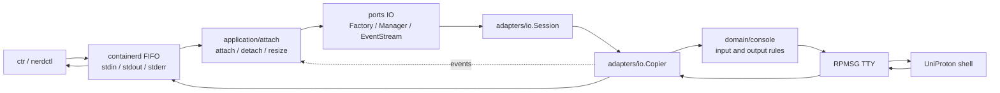

# MicRun IO 系统设计文档

## 概述

本文档描述 MicRun 的 IO 系统，用于处理 RTOS 容器的双向数据传输（containerd FIFO ↔ RPMSG TTY）。

## 架构

[IO 链路图](../README.md#io-链路)给出 attach 客户端到 RTOS shell 的数据通路；
[IO 交互细节图](../README.md#io-交互细节)突出 `nerdctl run -it`、attach、detach、
reattach、`Ctrl-C` 和 `exit` 在同一条 UniProton shell 路径上的时序关系。
本文下方的 Mermaid 图给出组件级 IO 主路径，评审时可对照实现检查。


```mermaid
flowchart LR
  client["ctr / nerdctl"]
  fifo["containerd FIFO<br/>stdin / stdout / stderr"]
  attach["application/attach<br/>attach / detach / resize"]
  ports["ports IO<br/>Factory / Manager / EventStream"]
  session["adapters/io.Session"]
  copier["adapters/io.Copier"]
  console["domain/console<br/>input and output rules"]
  tty["RPMSG TTY"]
  rtos["UniProton shell"]

  client --> fifo --> attach --> ports --> session --> copier
  copier --> console --> tty --> rtos
  rtos --> tty --> copier --> fifo --> client
  copier -. events .-> attach
```

```
┌─────────────────────────────────────────────────────────────┐
│                   containerd (ctr/nerdctl)                  │
│   ┌───────────┐  ┌───────────┐  ┌───────────────────┐       │
│   │ CreateTask│  │   Start   │  │     Attach        │       │
│   └─────┬─────┘  └─────┬─────┘  └─────────┬─────────┘       │
└─────────┼──────────────┼──────────────────┼─────────────────┘
          │              │    FIFO (stdio)  │
          └──────────────┴──────────────────┬┘
                                           ▼
┌─────────────────────────────────────────────────────────────┐
│                     MicRun Shim                             │
│  ┌───────────────────────────────────────────────────────┐  │
│  │            internal/application/attach               │  │
│  │  • attach / reattach orchestration                   │  │
│  │  • resize / stdin-close / detach semantics           │  │
│  └───────────────────────────────────────────────────────┘  │
│                            │                                │
│  ┌───────────────────────────────────────────────────────┐  │
│  │                 internal/adapters/io                 │  │
│  │  ┌──────────┐  ┌──────────┐  ┌───────────────────┐    │  │
│  │  │ Session  │  │  Copier  │  │     EventBus      │    │  │
│  │  │ • FIFO   │  │ • copy   │  │ • pub/sub         │    │  │
│  │  │ • manage │  │ • epoll  │  │                   │    │  │
│  │  └──────────┘  └──────────┘  └───────────────────┘    │  │
│  └───────────────────────────────────────────────────────┘  │
└──────────────────────────────┬──────────────────────────────┘
                               │ RPMSG TTY
                               ▼
┌─────────────────────────────────────────────────────────────┐
│                   Mica Daemon (micad)                       │
│  ┌───────────────────────────────────────────────────────┐  │
│  │             XL Console Management Module              │  │
│  └───────────────────────────────────────────────────────┘  │
└──────────────────────────────┬──────────────────────────────┘
                               ▼
┌─────────────────────────────────────────────────────────────┐
│                   Xen Hypervisor                            │
│  ┌───────────────────────────────────────────────────────┐  │
│  │           RTOS Container (Zephyr/UniProton)           │  │
│  │              /dev/ttyRPMSG_<container>_0              │  │
│  └───────────────────────────────────────────────────────┘  │
└─────────────────────────────────────────────────────────────┘
```

## 核心组件

### 文件结构

```
internal/application/attach/
└── service.go     # attach/detach/resize/stdin-close 语义编排

internal/domain/console/
├── input.go       # TTY/non-TTY 输入语义状态机
├── output.go      # RTOS 输出规范化：NUL 过滤 + 跨 chunk 换行压缩
└── *_test.go      # detach/interrupt/exit/CRLF/output 等纯领域测试

internal/adapters/io/
├── types.go           # 配置类型定义
├── copier.go          # Copier 结构体定义 + 字段管理
├── copier_epoll.go    # TTY epoll 入口（委托给 epollWaiter）
├── copier_stdin.go    # stdin 复制逻辑 + stdin epoll 重启用
├── copier_stdout.go   # stdout/stderr 复制逻辑
├── copier_helpers.go  # copier 辅助函数
├── epoll_waiter.go    # epollWaiter 独立类型（封装 epoll 创建/等待/信号/重启用）
├── session.go         # 会话管理 + Restart() 集成（支持 attach）
├── events.go          # 事件总线（解耦 IO 层和 shim 层）
├── binary.go          # Binary IO 支持（binary:// 协议）
├── factory.go         # IO session factory 实现
└── copier_test.go     # 单元测试
```

### 数据流

```
┌──────────┐   stdin FIFO   ┌──────────┐       ┌──────────────┐
│   ctr    │───────────────►│  Copier  │──────►│   TTY In     │
│ (client) │◄───────────────│          │◄──────│ /dev/ttyRPMSG│
└──────────┘  stdout FIFO   └──────────┘       └──────────────┘
```

### 核心功能

| 功能 | 实现位置 | 说明 |
|------|----------|------|
| FIFO 创建/打开 | `session.go` | 使用 `containerd/fifo` 包 |
| 双向数据复制 | `copier_stdin.go`, `copier_stdout.go` | 两个 goroutine: stdin→TTY, TTY→stdout |
| **Epoll 零 CPU 等待** | `epoll_waiter.go` | `epollWaiter` 独立类型，封装 epoll 创建/等待/信号 |
| **EventBus 事件系统** | `events.go` | 解耦 IO 层和 shim 层的事件驱动架构 |
| **输入语义状态机** | `internal/domain/console/input.go` | 解释 `Ctrl+C`、`Ctrl+P Ctrl+Q`、`exit`、CRLF、backspace |
| NUL 字节过滤 | `internal/domain/console/output.go` | RTOS 发送的 0x00 字节被过滤 |
| 换行压缩 | `internal/domain/console/output.go`, `rpmsg_tty.go` | `OutputNormalizer` 跨 read chunk 压缩连续 `\r\n` 序列 |
| **回声抑制** | `copier_stdout.go` | 避免 PTY 和 RTOS 同时回声导致重复显示 |
| FIFO/TTY 重新打开 | `session.Restart()` / `session.RestartWithTTYs()` | 支持多次 attach，终端 reattach 会刷新 guest TTY |
| **统一 stdout/stderr** | `copier_stdout.go` | 当 stdout 和 stderr 相同时使用单个 copier |

## 设计原则

### 单一职责

每个组件只负责一件事：
- `Session` - 管理 FIFO 生命周期，支持 attach/detach
- `Copier` - 负责数据复制和 epoll 优化
- `EventBus` - 负责事件发布和订阅（解耦 IO 层和 shim 层）
- `Attach Service` - 负责 attach/detach/resize/stdin-close 的业务语义

### 性能优化

- **Epoll 零 CPU 等待**：使用 epoll 替代轮询，空闲时 CPU 使用率从 70% 降至 ~0%
- **响应时间 <100ms**：epoll 超时设置为 100ms，平衡响应性和 CPU 使用
- **缓冲区复用**：重用缓冲区减少内存分配

### 输入语义分层

MicRun 把“用户按键含义”和“会话生命周期动作”分开处理：

- `internal/domain/console` 识别 TTY/non-TTY 输入语义，例如 `Ctrl+C`、`Ctrl+P Ctrl+Q`、`exit`、CRLF 和 backspace。
- `internal/adapters/io.Copier` 只执行状态机给出的动作：写 TTY、写本地回显、发布事件、停止当前 copier。
- `internal/application/attach.Service` 决定事件含义：detach 只断开当前会话并保留 FIFO，interrupt/exit 才进入停止流程。

因此 detach 不是单纯依赖客户端实现。`nerdctl` 的体验最接近 Docker；`ctr` 没有 Docker 风格的 detach 封装，但在 TTY 字节流中发送 `Ctrl+P Ctrl+Q` 时仍会被 MicRun 的输入状态机识别。

### 最小化依赖

只依赖必要的包：
- `github.com/containerd/fifo` - FIFO 操作
- 标准库 `io`, `syscall`, `sync` - 基础 IO

## 配置 (Config)

```go
type Config struct {
    // Container ID
    ContainerID string

    // FIFO 路径 (从 containerd 传入)
    StdinFIFO  string
    StdoutFIFO string
    StderrFIFO string

    // TTY 接口 (从 RPMSG 获取)
    TTYIn  io.WriteCloser  // stdin → TTY
    TTYOut io.Reader      // TTY → stdout
    TTYErr io.Reader      // TTY → stderr (可选)

    // 选项
    Terminal  bool  // 是否为终端模式
    FilterNUL bool  // 是否过滤 NUL 字节 (RTOS 需要)

    // 缓冲区大小
    StdinBufSize  int  // 默认 4KB
    StdoutBufSize int  // 默认 32KB
}
```

## IO 模式分类：ctr/nerdctl 命令选项组合

MicRun shim 支持 `ctr` 和 `nerdctl` 两种客户端工具，它们支持不同的命令选项：

| 选项 | ctr | nerdctl | 说明 |
|------|-----|---------|------|
| `-i` | ❌ 不支持 | ✅ 支持 | nerdctl 提供输入（使用 nerdctl 提供的 stdin 路径） |
| `-t` | ✅ 支持 | ✅ 支持 | 启用 TTY 终端模式 |
| `-d` | ✅ 支持 | ✅ 支持 | 后台运行（无 stdin FIFO = 后台） |

**重要**：`-i` 选项在 nerdctl 中表示"提供输入"，不带 `-i` 时 nerdctl 表示只读不提供输入。但为了兼容 ctr（ctr 没有 `-i` 选项，一定会指定输入），我们在 shim 层统一生成 stdin FIFO。

### 理论上的 8 种组合 vs 实际的 6 种模式

三个选项 `-i`, `-t`, `-d` 的理论组合是 2³ = 8 种：

| 编号 | 组合 | nerdctl 支持 | 说明 |
|------|------|-------------|------|
| 1 | 无选项 | ✅ | 前台非 TTY |
| 2 | `-i` | ✅ | 前台交互非 TTY |
| 3 | `-t` | ✅ | 前台 TTY |
| 4 | `-i -t` | ✅ | 前台交互 TTY |
| 5 | `-d` | ✅ | 后台非 TTY |
| 6 | `-i -d` | ❌ | **nerdctl 拦截**（交互式后台无意义） |
| 7 | `-t -d` | ✅ | 后台 TTY |
| 8 | `-i -t -d` | ❌ | **nerdctl 拦截**（交互式后台 TTY 无意义） |

**为什么 nerdctl 拦截 `-i -d` 组合？**

- `-i` 表示"需要交互输入"
- `-d` 表示"后台运行，立即返回"
- 两者语义冲突：后台模式通常不需要交互输入
- nerdctl 在 CLI 层拦截并报错：`"interactive mode requires -i and -t to be specified"`

### MicRun 支持的 6 种 IO 模式

| 模式 | 命令 | IsTTY | IsForeground | HasStdin | stdin来源 | attach能力 | detach能力 | 使用场景 |
|------|------|-------|--------------|----------|----------|-----------|-----------|---------|
| 1 | `-i -t` | ✅ | ✅ | ✅ | nerdctl提供 | **多次attach** | ✅ (Ctrl+P Ctrl+Q) | 交互式TTY调试，需反复attach |
| 2 | `-i` | ❌ | ✅ | ✅ | nerdctl提供 | ✅ attach | ❌ | 交互式非TTY，简单调试 |
| 3 | `-t -d` | ✅ | ❌ | ✅ | 生成标准FIFO | **多次attach** | ✅ (Ctrl+P Ctrl+Q) | 后台TTY调试，需反复attach |
| 4 | `-t` | ✅ | ✅ | ✅ | 生成标准FIFO | **多次attach** | ✅ (Ctrl+P Ctrl+Q) | 前台TTY查看输出 |
| 5 | `-d` | ❌ | ❌ | ✅ | 生成标准FIFO | ✅ attach | ❌ | 长期运行服务 |
| 6 | 无选项 | ❌ | ✅ | ✅ | 生成标准FIFO | ✅ attach | ❌ | 默认前台运行 |

### 核心判断规则

```go
// internal/transport/shimv2/iomode.go

// IsTTY: TTY 模式（影响终端配置、本地回显、detach 支持）
mode.IsTTY = r.Terminal

// IsForeground: 前台模式（有 nerdctl 提供的 stdin FIFO = 前台）
mode.IsForeground = IsValidFIFOPath(r.Stdin) || IsValidFIFOPath(r.Stdout) || IsValidFIFOPath(r.Stderr)

// HasStdin: 所有模式都支持输入（兼容 ctr）
mode.HasStdin = true
// - 带 -i: 使用 nerdctl 提供的 stdin (r.Stdin != "")
// - 不带 -i: 生成标准 stdin FIFO 以兼容 ctr

// SupportsAttach: 后台模式 或 TTY模式
mode.SupportsAttach = !mode.IsForeground || mode.IsTTY
// - TTY 模式支持多次 attach（detach 后可重新 attach）
// - 后台模式支持 attach

// SupportsDetach: TTY 模式
mode.SupportsDetach = r.Terminal && mode.HasStdin
// - TTY 模式支持 Ctrl+P Ctrl+Q detach (nerdctl native mechanism)
```

### FIFO 路径生成规则

| 模式 | stdin | stdout | stderr | 说明 |
|------|-------|--------|--------|------|
| 1. `-i -t` | 使用 nerdctl 提供的路径 | 使用 nerdctl 提供的路径 | 使用 nerdctl 提供的路径 | nerdctl 提供具体路径 |
| 2. `-i` | 使用 nerdctl 提供的路径 | 使用 nerdctl 提供的路径 | 使用 nerdctl 提供的路径 | nerdctl 提供具体路径 |
| 3. `-t -d` | 生成标准 FIFO | 转换或生成 | 转换或生成 | 兼容 ctr，生成 stdin FIFO |
| 4. `-t` | 生成标准 FIFO | 转换或生成 | **合并到 stdout** | 兼容 ctr，生成 stdin FIFO |
| 5. `-d` | 生成标准 FIFO | 转换或生成 | 转换或生成 | 兼容 ctr，生成 stdin FIFO |
| 6. 无选项 | 生成标准 FIFO | 使用提供的路径 | 使用提供的路径 | 兼容 ctr，生成 stdin FIFO |

**标准 FIFO 路径格式**：
```
/run/containerd/io.containerd.runtime.v2.task/<namespace>/<container_id>/<stream>
```

### 面向用户的统一交互语义

用户可见的停止/离开/回连/管道语义的**唯一权威**是
[容器生命周期与 IO 会话语义](../user/lifecycle-semantics.md)：
§2（三种离开方式）、§3（结局矩阵）、§6（正确姿势清单）。此处只保留 IO 视角的一句话概括：**detach 与 stop 永远分开**
（`Ctrl+P Ctrl+Q` 只离开不停止，`stop/kill/raw 终端 Ctrl+C` 表达停止意图）；
非 TTY/管道输入一律按普通字节流处理，无键序语义。

### 使用场景推荐

| 使用场景 | 推荐命令 | attach支持 | detach支持 | 适用场景 |
|---------|---------|-----------|-----------|---------|
| 交互式TTY调试 | `nerdctl run -i -t` | ✅ 多次 | ✅ Ctrl+P Ctrl+Q | 临时调试，需要反复 attach |
| 交互式非TTY | `nerdctl run -i` | ✅ attach | ❌ | 简单交互，不需要 detach |
| TTY后台调试 | `nerdctl run -t -d` | ✅ 多次 | ✅ Ctrl+P Ctrl+Q | 后台调试，需要反复 attach |
| TTY前台查看 | `nerdctl run -t` | ✅ 多次 | ✅ Ctrl+P Ctrl+Q | 查看输出，可随时 detach |
| 长期运行服务 | `nerdctl run -d` | ✅ attach | ❌ | 守护进程、后台服务 |
| 默认前台运行 | `nerdctl run` | ✅ attach | ❌ | 简单前台任务 |

### ctr 与 nerdctl 的兼容性设计

**设计原则**：
- **统一 shim 行为**：ctr 和 nerdctl 使用相同的 shim API 和行为
- **stdin 兼容性**：不带 `-i` 时生成标准 stdin FIFO，确保 ctr 可以正常工作
- **attach 统一**：TTY 模式统一支持多次 attach，便于调试

**ctr 命令示例**：
```bash
# ctr 没有 -i 选项，但 shim 会生成 stdin FIFO
ctr run -t localhost:5000/mica-uniproton-app:xen-0.1 test-tty
ctr run -d localhost:5000/mica-uniproton-app:xen-0.1 test-daemon
```

**nerdctl 命令示例**：
```bash
# nerdctl 有 -i 选项，会提供 stdin FIFO
nerdctl run -i -t localhost:5000/mica-uniproton-app:xen-0.1 test-interactive
nerdctl run -i localhost:5000/mica-uniproton-app:xen-0.1 test-non-tty

# nerdctl 拦截 -i -d 组合并报错
nerdctl run -i -d localhost:5000/mica-uniproton-app:xen-0.1 test
# Error: interactive mode requires -i and -t to be specified
```

## 使用方式

### Shim 中使用

```go
// internal/application/lifecycle/service_wait.go

if taskHandle.CanBeSandbox() {
    sandbox.Start(ctx)
} else {
    sandbox.StartContainer(ctx, taskHandle.ID())
}

stdin, stdout, stderr, _ := sandbox.IOStream(taskHandle.ID(), taskHandle.ID())
taskHandle.SetStdinPipe(stdin)
attachService.StartInitialSession(ctx, runtime, taskHandle, stdin, stdout, stderr)
go lifecycle.waitForExit(runtime.BackgroundContext(), runtime, taskHandle)
```

### NUL 字节过滤

RTOS (如 UniProton) 通过 RPMSG TTY 发送的数据可能包含 NUL 字节 (0x00)，这些字节需要被过滤掉：

```go
// internal/domain/console/output.go

// FilterNUL 过滤 NUL 字节
func FilterNUL(dst, src []byte) []byte { ... }
```

### 换行压缩 (Line Ending Compression)

**问题描述：**

RTOS 容器在交互式 shell 中按回车键会产生多余的空行。例如：
```
Hello, UniProton!


openEuler UniProton #
```
预期只有 1-2 个空行，实际出现了 3+ 个空行。

**根本原因：**

1. **TTY 输出处理**：TTY 的 `ONLCR` termios 标志将 `\n` 转换为 `\r\n`。当 RTOS 固件已经发送 `\r\n` 作为换行符时，这会导致 `\r\r\n`，在终端上显示为额外的空行。

2. **RTOS 固件行为**：RTOS 固件本身会输出多个连续的 `\r\n` 序列。

**解决方案：**

1. **禁用 TTY 输出处理** (`internal/domain/container/rpmsg_tty.go`)：
   ```go
   // 禁用 OPOST 和所有输出处理标志
   // RTOS 已经发送正确的换行符 (\r\n)
   // TTY 应该透传数据，不做任何转换
   termios.Oflag &^= unix.OPOST | unix.ONLCR | unix.OCRNL | unix.OLCUC
   ```

2. **压缩连续换行符** (`internal/domain/console/output.go`)：
    ```go
    normalizer := console.NewOutputNormalizer(console.OutputConfig{
        FilterNUL: true,
        CompressLineEndings: true,
    })
    data := normalizer.Normalize(data)
    ```

   在 `copyStdout()` 中集成：
   ```go
   // 按流状态规范化输出，支持跨 read chunk 的 \r\n 压缩
   data = normalizer.Normalize(buf[:n])
   ```

**验证结果：**

修复后的输出：
```
Hello, UniProton!

openEuler UniProton #
```
只有 1 个空行（符合预期），而不是修复前的 3+ 个空行。

**测试：**

运行验证测试（在边侧主机上）：
```bash
export EDGE_SSH_USER="${EDGE_SSH_USER:-root}"
export EDGE_IP="${EDGE_IP:-192.168.7.2}"
export TEST_REMOTE_HOST="${TEST_REMOTE_HOST:-${EDGE_SSH_USER}@${EDGE_IP}}"
bash tests/io/test_newline_fix_verify.sh
```

### Exit 命令处理和 1:1:1 生命周期

**概述**

用户在 RTOS 容器的交互式 shell 中输入 "exit" 命令可以安全退出容器。同时遵守 1:1:1 的生命周期模型：

```
+---------------------------------------------------------------+
|                         Shim Process                          |
|  - Continues running, responds to containerd API              |
|  - Not affected by user exit or detach                        |
+---------------------------------------------------------------+
|                            Sandbox                            |
|  - Manages one RTOS container                                 |
|  - Stop (stops RTOS) on container exit                        |
|  - Delete (removes resources) on Delete API                   |
+---------------------------------------------------------------+
|                         RTOS (micad)                          |
|  - Actually runs UniProton RTOS instance                      |
|  - Controlled via libmica.Start/Stop                          |
+---------------------------------------------------------------+
```

**生命周期行为**

事件 → 结局（task 记录、shim 存活、容器形态）的完整矩阵由
[容器生命周期与 IO 会话语义](../user/lifecycle-semantics.md) §3 权威维护，
本文不再复述。实现侧只需记住两条契约：

- **shim 自己从不因为"容器停止"而退出**：容器退出后 shim 驻留，等待
  containerd 侧的 **Delete → Shutdown 收尾链**（`internal/transport/shimv2/events.go`
  注释原文 "keeping shim running for cleanup"）。
- **收尾链的触发源**包括显式 `ctr task delete` / `ctr container delete` /
  `nerdctl rm`，以及 attach 客户端进程死亡（亚秒级自动发起）；机理详见权威 §5。

## 前台模式 vs 后台模式：Shim 生命周期设计

### 问题背景与 containerd 设计

1:1:1 生命周期模型（RTOS 停止 → Sandbox 停止 → Shim 继续运行）在两种启动模式下
行为一致；差异只在 ctr CLI：前台模式客户端与任务绑定（保持 gRPC 连接等待退出），
后台模式启动后立即返回。containerd 侧 Create/Start/Delete/Shutdown 的调用链与
containerd `runtime/v2/shim.go` 源码一致，细节移步上游源码或
[容器生命周期与 IO 会话语义](../user/lifecycle-semantics.md) §5（含 Delete→Shutdown
收尾链与 "shim disconnected" 兜底清理的实测日志链）。

### 前台模式 vs 后台模式的实际差异

两种模式下 shim 生命周期一致（上文两条契约）；实际差异全在 ctr CLI 一侧：

**差异点**：
| 特性 | 前台模式 | 后台模式 |
|------|---------|---------|
| ctr CLI 连接 | 保持 gRPC 连接 | 启动后立即断开 |
| IO 流 | 实时转发到用户终端 | 通常重定向到日志/FIFO |
| ctr CLI 阻塞 | 是，等待容器退出 | 否，立即返回 |
| 用户退出方式 | `stop/kill`，或 shell 内输入 `exit` 兜底 | 需要 attach 后交互，或外部 `stop/kill` |
| shim 生命周期 | **继续运行** | **继续运行** |

### 总结

容器退出方式、auto-close 超时、shim 清理时机的完整语义以
[容器生命周期与 IO 会话语义](../user/lifecycle-semantics.md) §3（结局矩阵）
与 §5（shim 退出机理）为唯一权威，此处不再复述清单。

本文件独有的实操建议：

- 开发调试：`ctr task start`（前台，便于查看输出）
- 生产环境：`ctr task start -d`（后台，daemon 模式）+ `auto_close=false` 注解

---

## EventBus 事件系统

### 概述

EventBus 是 IO 层和 shim 层之间的解耦机制。IO 层发布事件，shim 层订阅事件并做出响应。这种设计使得 IO 层不需要直接依赖 shim 层的接口。

### 架构

```
+----------------------------------------------------------------+
|                          IO Layer                              |
|  +-------------+   +-------------+   +-------------+           |
|  |   Copier    |   |   Session   |   |  Publisher  |           |
|  | - detect    |   | - manage    |   | - publish   |           |
|  |   events    |   |   state     |   |   events    |           |
|  +------+------+   +-------------+   +-------------+           |
|         |                                                      |
|         v                                                      |
|  +----------------------------------------------------------+  |
|  |                        EventBus                             |
|  | - subscribe                    - dispatch                   |
|  +----------------------------+-----------------------------+  |
|                               |                                |
|                               v (subscribe)                    |
|  +----------------------------------------------------------+  |
|  |                    Shim Layer (Subscriber)                  |
|  |  Handle: ExitCommandDetected / InterruptDetected            |
|  +----------------------------------------------------------+  |
+----------------------------------------------------------------+
```

### 事件类型

| 事件类型 | 触发条件 | 订阅者行为 |
|----------|----------|-----------|
| `ExitCommandDetected` | 用户输入 "exit" 命令 | shim 停止容器 |
| `InterruptDetected` | TTY 会话中用户按 `Ctrl+C` | shim 以 130 状态停止容器 |
| `IOError` | IO 操作发生错误 | shim 记录错误并处理 |
| `TTYReady` | TTY 准备就绪 | shim 继续启动流程 |
| `StdinClosed` | stdin FIFO 被客户端关闭 | shim 检测容器状态 |
| `ClientAttached` | stdin FIFO 出现活跃写端（attach 客户端接入） | 应用层更新任务 attach 状态，auto-close 计时挂起 |
| `ClientDetached` | 写端关闭（非 TTY EOF / create-time 无写端） | 应用层清除 attach 状态并启动 auto-close 宽限 |
| `DetachDetected` | 用户输入 detach 序列 | shim 处理 detach |

### API 使用

**事件命名映射**：IO 层（`internal/adapters/io`）使用 `io.ExitCommandDetected`
等类型名；跨层订阅（`internal/ports`）使用 `ports.IOEventExitCommand` 等
`IOEvent*` 类型。二者一一对应，应用层一律以 `ports.IOEvent*` 为权威。

**订阅事件**（application 层）：

```go
events := eventStream.SubscribeMany(
    ports.IOEventExitCommand,
    ports.IOEventStdinClosed,
    ports.IOEventDetach,
    ports.IOEventInterrupt,
    ports.IOEventError,
)
go func() {
    for event := range events {
        log.Infof("Received event: %v for container %s", event.Type, event.ContainerID)
        // 处理事件...
    }
}()
```

`application/attach` 只消费一个合并后的事件流，再按 `event.Type` 分派行为。
这样新增 IO 事件时不需要扩展 `handleIOEvents` 的参数列表。

**清理资源**：

```go
// 关闭事件总线，所有订阅者通道都会被关闭
eventBus.Close()
```

### 设计特点

1. **解耦**：IO 层不需要知道 shim 层的存在，只需发布事件
2. **非阻塞**：发布事件不会阻塞，通道满时丢弃事件
3. **自动清理**：订阅者通过 context 生命周期自动清理
4. **类型安全**：使用 EventType 枚举确保事件类型正确

### 使用场景

1. **容器退出**：IO 层检测到 "exit" 命令 → 发布 `ExitCommandDetected` → shim 停止容器
2. **用户中断**：TTY 会话中检测到 `Ctrl+C` → 发布 `InterruptDetected` → shim 以 130 状态停止容器
3. **客户端断开**：IO 层检测到 stdin 关闭 → 发布 `StdinClosed` → shim 检查是否需要停止容器
4. **错误处理**：IO 层检测到错误 → 发布 `IOError` → shim 记录日志并采取恢复措施

---

## Binary:// 协议

### 概述

`binary://` 协议允许通过外部程序处理容器的 IO 流。这主要用于日志处理、数据转换等场景，特别是 nerdctl 的 detached 模式。

### URI 格式

```
binary://<binary-path>?<query-params>
```

- `binary-path`: 可执行文件的绝对或相对路径
- `query-params`: 传递给二进制程序的环境变量（格式：`key=value&key2=value2`）

### 工作原理

```
+--------------+     +-------------+     +--------------+
|  Shim        |---->| Binary Proc  |---->|  Log File    |
|              |     | (external)  |     | /var/log/... |
+--------------+     +-------------+     +--------------+
      |                                       ^
      |                                       |
      +------------ RTOS stdout/stderr ------+
```

### 数据流

1. **RTOS → Binary**：通过 pipe 传输，Binary 处理后输出
2. **Binary → 用户**：通过 stdout 传输给用户
3. **用户 → RTOS**：通过 pipe 传输，Binary 转发到 RTOS

### 配置方式

`binary://` 协议由容器运行时工具（如 nerdctl）在后台模式（`-d`）时自动使用，MicRun shim 会将其转换为 FIFO 路径以支持后续 attach 操作。这是工具内部机制，用户无需手动配置。

### 使用场景

1. **日志处理**：将 RTOS 输出重定向到日志处理程序
2. **数据转换**：将 RTOS 二进制数据转换为可读格式
3. **远程传输**：将日志实时传输到远程服务器

### 实现细节

```go
// internal/adapters/io/binary.go

// BinaryIO 处理外部程序的 IO
type BinaryIO struct {
    cmd       *exec.Cmd
    container string
    uri       *url.URL
    // Pipes for communication...
}

// 创建 BinaryIO
binaryIO, err := io.NewBinaryIO(ctx, containerID, uri)
if err != nil {
    return err
}

// 获取 IO 接口
stdoutWriter := binaryIO.Stdout()  // 容器输出 → Binary
stdinReader := binaryIO.Stdin()   // Binary → 容器输入
```

---

## Session 状态管理

### 概述

Session 负责管理 IO 会话的生命周期，包括 FIFO 创建、打开、数据复制和关闭。Session 支持多次 attach：普通 reattach 通过 `Restart()` 重开 FIFO，终端 reattach 通过 `RestartWithTTYs()` 同时刷新 guest TTY 句柄。

### 状态机

```
+----------+
|  Created |  <- NewSession()
+-----+----+
      |
      | Start()
      v
+----------+
| Started  | <- FIFO created, Copier running
+-----+----+
      |
      | Stop()
      v
+----------+
|  Stopped | <- Copier stopped, FIFO closed
+----------+
```

### 生命周期方法

| 方法 | 说明 | 时机 |
|------|------|------|
| `NewSession()` | 创建新会话 | shim 启动时 |
| `Start()` | 创建 FIFO，启动 Copier | 首次启动 |
| `Stop()` | 停止 Copier，关闭 FIFO/TTY | 容器停止、最终清理 |
| `StopWithoutClosingFIFOs()` | 停止 Copier，但保留 FIFO/TTY | TTY detach，等待后续 attach |
| `Restart()` | 重新确保并打开 FIFO，启动新 Copier | 非终端 reattach 或无需刷新 TTY 的恢复 |
| `RestartWithTTYs()` | 用 fresh TTY 重新打开 FIFO 并启动新 Copier | 终端 reattach、resize 前恢复 |

### Restart 机制

`Restart()` 方法支持多次 attach，其流程如下：

```
+---------------------------------------------------------------+
|                  Attach Process                               |
|                                                                 |
|  Client Attach --> attach.Service --> session.Restart*()       |
|                          |                                    |
|                          v                                    |
|              +--------------------------------------+         |
|              | 1. detach keeps old FIFO/TTY handles |         |
|              | 2. ensure FIFO paths still exist     |         |
|              | 3. open FIFO, optionally fresh TTY   |         |
|              | 4. start candidate copier            |         |
|              | 5. commit new session state          |         |
|              +--------------------------------------+         |
|                          |                                    |
|                          v                                    |
|                   New Copier uses new FIFO                    |
|                                                                 |
+---------------------------------------------------------------+
```

### FIFO 路径管理

```go
// 生成标准 FIFO 路径
func GenerateStandardFIFOPath(namespace, containerID, stream string) string {
    return filepath.Join(
        "/run/containerd/io.containerd.runtime.v2.task",
        namespace,
        containerID,
        stream,  // "stdin", "stdout", "stderr"
    )
}
```

### 状态转换

| 当前状态 | 允许的操作 | 下一状态 |
|----------|-----------|----------|
| Created | Start() | Started |
| Started | Stop(), StopWithoutClosingFIFOs() | Stopped |
| Stopped | Restart(), RestartWithTTYs() | Started |

### 注意事项

1. **幂等性**：多次调用 `Stop()` 是安全的，只有第一次会生效
2. **资源清理**：`Stop()` 会关闭 FIFO/TTY 并停止 Copier；detach 只调用 `StopWithoutClosingFIFOs()`
3. **并发安全**：所有方法都使用 `sync.Mutex` 保护内部状态
4. **Context 取消**：Context 取消时会自动清理资源

---

## 客户端兼容性

### ctr

- ✅ `ctr task start` - 交互式启动（阻塞直到容器退出）
- ✅ `ctr task attach` - 附加到运行中的容器
- ⚠️ detach - `ctr` 没有 Docker/nerdctl 风格的 detach 封装；TTY 中发送 `Ctrl+P Ctrl+Q` 可触发 MicRun detach

### nerdctl

- ✅ `nerdctl run -d` - 后台启动
- ✅ `nerdctl attach` - 附加
- ✅ `nerdctl run --detach-keys=ctrl-p,ctrl-q` - detach 支持
- ✅ `binary://` 协议 - 用于日志处理（见 `adapters/io/binary.go`）

### Kubernetes (CRI)

- ✅ 通过 CRI API 管理
- ✅ attach/detach 由 kubelet 处理

## 实现说明

IO 架构为三层拆分：

1. `internal/adapters/io`
   说明：只负责 IO 会话和字节流转发
2. `internal/ports/io.go`
   说明：对上暴露 `IOSessionFactory`、`IOEventStream`、`IOManager`
3. `internal/application/attach`
   说明：负责 attach/detach/resize/stdin-close/exit-command 的业务语义

IO 适配器内部的进一步拆分：

- `internal/domain/console`：输入语义状态机（统一解释 TTY/non-TTY 下的 `exit`、`Ctrl+C`、`Ctrl+P Ctrl+Q`、CRLF、backspace）与输出规范化状态机（NUL 过滤、跨 chunk 换行压缩）
- `epoll_waiter.go`：`epollWaiter` 独立类型，封装 epoll 生命周期的创建/等待/信号/重启用/关闭，支持边沿触发（TTY stdout）和水平触发（stdin）两种模式
- `copier_epoll.go`：约 20 行，完全委托给 `ttyWaiter`/`stdinWaiter` 两个 `epollWaiter` 实例
- `session.go`：通过 `Copier()` 暴露底层 copier，符合 Go 命名惯例

职责边界：

- `Task` 句柄不承载 attach 编排行为
- transport 层不直接持有事件处理器
- `DetachDetected` 事件在应用层消费并转为明确行为
- `Copier` 是设备搬运层；领域状态机负责解释用户意图
- `application/attach` 不直接 import `internal/adapters/io`
- 重新 attach / resize 时若 `IOManager` 缺失，通过统一 session factory 重建 session 与事件订阅

用户可见的状态流（含 detach/进程死亡/EOF 各离开方式的结局）以
[容器生命周期与 IO 会话语义](../user/lifecycle-semantics.md) §4 的
权威状态图为准，此处不再重复维护一份。

### 日志标识

```
[SESSION] ...  # 会话管理日志
[IO] ...      # 数据复制日志
[EVENT] ...   # 事件总线日志
[TTY] ...     # RPMSG TTY 配置日志
```

### 常见问题

退出容器与 exit/shim 生命周期类问题见 [容器生命周期与 IO 会话语义](../user/lifecycle-semantics.md) §5（shim 退出机理）与 §6（正确姿势）。

**Q: attach 后没有输出**
A: 检查 FIFO 路径是否正确，TTY 是否已打开

**Q: 容器退出后 FIFO 没有清理**
A: 检查 `session.Stop()` 是否被调用

**Q: 交互式 shell 中有多余的空行**
A: 这是 TTY 输出处理和 RTOS 固件行为共同导致的问题。
   - 确保 `internal/domain/container/rpmsg_tty.go` 中禁用了 `OPOST|ONLCR`
   - 确保 `internal/domain/console/output.go` 的 `OutputNormalizer` 已在 stdout 路径启用
   - 运行 `tests/io/test_newline_fix_verify.sh` 验证修复

## 参考文献

1. [containerd Runtime v2 README](https://github.com/containerd/containerd/blob/main/core/runtime/v2/README.md) - containerd 官方 shim v2 规范
2. [containerd FIFO package](https://github.com/containerd/fifo)
3. [iximiuz - Implementing Container Runtime Shim](https://iximiuz.com/en/posts/implementing-container-runtime-shim/) - Shim 架构深度分析
4. [云原生实验室 - Containerd shim 原理深入解读](https://icloudnative.io/posts/shim-shiminey-shim-shiminey/) - 中文 shim 原理解析
5. [GitHub Issue #9727 - Containerd shim lifecycle discussion](https://github.com/containerd/containerd/issues/9727) - Shim 生命周期讨论
