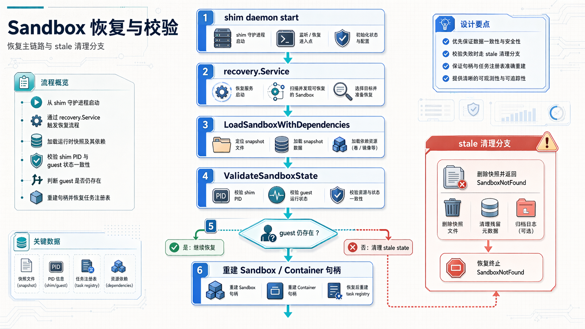
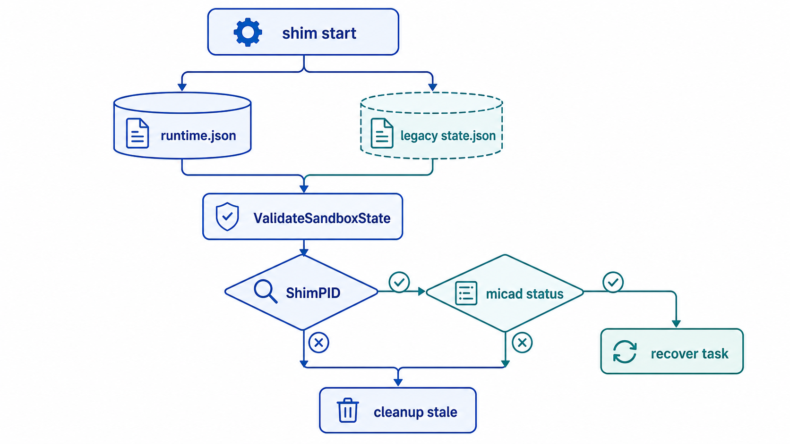
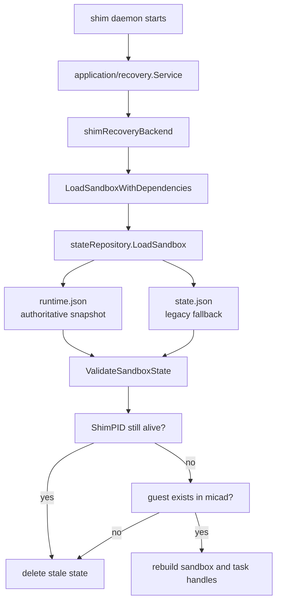

# MicRun Sandbox 状态验证文档

本文档描述 MicRun 当前的 sandbox 状态验证机制。这里说的“当前”是指以 `StateStore + runtime.json` 为主、legacy `state.json` 为兼容回退的实现。

## 1. 目标

状态验证的目标不是简单“把文件读出来”，而是回答三个问题：

1. 这份持久化状态是不是当前 sandbox 的状态
2. 这份状态是不是还能恢复
3. 如果不能恢复，是应该拒绝恢复还是直接清理为 stale 状态

## 2. 当前状态存储布局

### 2.1 权威状态源

MicRun 当前通过 `internal/adapters/state/file.Store` 把快照写到 `/run/micrun` 下：

- sandbox snapshot: `/run/micrun/runtime/sandbox/<sandbox-id>/runtime.json`
- container snapshot: `/run/micrun/runtime/container/<container-path-or-id>/runtime.json`

这两类 `runtime.json` 是当前恢复链路的第一读取来源，也是新状态的唯一写入目标。

### 2.2 legacy 兼容路径

恢复时仍会兼容以下旧路径：

- `/run/micrun/sandbox/<sandbox-id>/state.json`
- `/run/micrun/<container-path>/state.json`
- `/run/micrun/<container-id>/state.json`

兼容策略如下：

1. 优先读取 `runtime.json`
2. `runtime.json` 不存在时再读 legacy `state.json`
3. 如果成功从 legacy 文件恢复，会尝试迁移写回 `runtime.json`

因此 legacy 文件已经不是权威状态源，只是历史数据入口。

## 3. 恢复与验证链路



下面的决策图用于快速区分“可以恢复”和“应该清理 stale 状态”的分支。





当前恢复主链路为：

```text
shim daemon start
  -> application/recovery.Service
  -> shimRecoveryBackend.Restore
  -> domain/container.LoadSandboxWithDependencies
  -> stateRepository.LoadSandbox
  -> ValidateSandboxState
  -> createSandbox + loadContainersToSandbox
```

职责划分如下：

- `shimRecoveryBackend.Restore`
  - 把 shim 恢复请求翻译成领域恢复动作
- `stateRepository.LoadSandbox`
  - 优先从 `StateStore` 读取
  - 必要时回退并迁移 legacy `state.json`
- `ValidateSandboxState`
  - 验证 shim PID
  - 验证 guest 是否仍存在于 micad
  - 验证状态是否 stale
- `createSandbox` / `loadContainersToSandbox`
  - 用恢复出的配置和依赖重建领域对象

## 4. 当前验证规则

### 4.1 快照级校验

从存储恢复 `SandboxStorage` 后，会先做以下校验：

| 校验项 | 当前行为 |
|------|------|
| `storage == nil` | 直接报错 |
| `storage.ID != sandboxID` | 拒绝恢复 |
| `ShimPID` 仍存活 | 拒绝恢复，认为已有其他 shim 实例在工作 |

`ShimPID` 的作用是避免两个 shim 同时接管同一份状态。

### 4.2 运行态校验

`ValidateSandboxState()` 当前会进一步做 guest 侧校验：

| 校验项 | 当前行为 |
|------|------|
| `guestCtl.Exists(ctx, id) == false` | 标记为 stale，删除持久化状态并返回 `SandboxNotFound` |
| `guestCtl.Status()` 失败 | 记录告警，但允许继续恢复 |
| 文件状态与 guest 实际状态不一致 | 记录告警，不立即拒绝恢复 |

这说明当前策略是“先确保不是明显 stale，再允许恢复；状态不一致先告警，后续再由运行时操作收敛”。

### 4.3 状态机保护

恢复只是入口，运行期状态转换仍由领域状态机兜底：

- `Start()` 会把 `StateCreating` 先收敛到 `StateReady`
- `Stop()` 只允许合法迁移到 `StateStopped`
- `Delete()` 只允许在 `Ready`、`Paused`、`Stopped` 下执行

因此状态验证和状态机保护是两层不同的防线：

1. 恢复时验证“这份状态还能不能接管”
2. 运行时验证“当前状态能不能执行这个动作”

## 5. 状态写入与删除时机

### 5.1 Sandbox 写入

`Sandbox.StoreSandbox()` 最终会调用 `stateRepository.SaveSandbox()`。当前写入内容包括：

- `ID`
- `State`
- `Config`
- `Network`
- `CreatedAt`
- `ShimPID`

常见触发点：

- sandbox 创建完成后
- sandbox 启动后
- sandbox 停止后
- 需要更新 sandbox 配置时

### 5.2 Sandbox 删除

`DeleteSandbox()` 会同时：

1. 删除 `runtime/sandbox/<id>/runtime.json`
2. 删除 legacy `/run/micrun/sandbox/<id>/`

### 5.3 Container 写入

container 快照也会同步写入 `runtime/container/.../runtime.json`，恢复 sandbox 时再把 containers 一并装回领域对象。

## 6. 调试方法

### 6.1 查看当前权威快照

```bash
# 查看所有 sandbox 快照
ls -la /run/micrun/runtime/sandbox/

# 查看单个 sandbox 快照
cat /run/micrun/runtime/sandbox/<sandbox-id>/runtime.json | jq

# 查看 container 快照
find /run/micrun/runtime/container -maxdepth 3 -name runtime.json | grep <container-id>
```

### 6.2 查看 legacy 回退文件

```bash
cat /run/micrun/sandbox/<sandbox-id>/state.json | jq
```

只有在排查历史遗留问题时才建议看这里；正常情况下应先看 `runtime.json`。

### 6.3 常见日志线索

常见关键日志包括：

- `[RESTORE]`
- `Cleaning up stale sandbox state`
- `shim PID ... is dead`
- `RTOS client not found in micad`
- `state mismatch, file=...`

## 7. 常见问题

**Q: shim 重启后恢复失败，但 `runtime.json` 还在？**
A: 先检查 `ShimPID` 对应进程是否仍存活；如果旧 shim 没退出，当前恢复会被拒绝。

**Q: 为什么快照存在却被清理掉了？**
A: 当前实现把“micad 中 guest 已不存在”视为 stale 状态，会删除持久化状态并返回 `SandboxNotFound`。

**Q: 文件状态是 `running`，但 guest 实际已经停了，为什么没有直接拒绝恢复？**
A: 当前策略对这类不一致先告警、再允许恢复，便于后续清理或重新启动时继续收敛状态。

**Q: 手工排查应该先看哪份文件？**
A: 先看 `/run/micrun/runtime/sandbox/<sandbox-id>/runtime.json`，再看 legacy `/run/micrun/sandbox/<sandbox-id>/state.json`。

## 8. 相关代码

| 文件 | 说明 |
|------|------|
| `internal/domain/container/state_repository.go` | 运行时快照加载、保存、legacy 回退与迁移 |
| `internal/domain/container/sandbox_loader.go` | sandbox 恢复与状态校验入口 |
| `internal/domain/container/sandbox_state.go` | `Sandbox.StoreSandbox()` 与 restore |
| `internal/domain/container/runtime_state.go` | runtime snapshot namespace 定义 |
| `internal/transport/shimv2/recovery_backend.go` | shim 恢复后端实现 |
| `definitions/paths.go` | 状态目录常量 |
