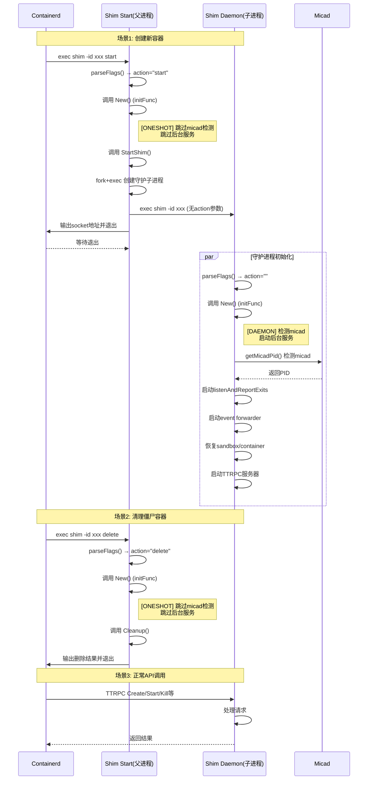

# Micrun Shim 开发笔记

> 本文档记录micrun shim开发过程中的设计决策、技术细节和最佳实践。
> 内容持续扩展中...

## 目录

- [为什么在New()中区分一次性命令和守护进程](#为什么在new中区分一次性命令和守护进程)
- [Containerd Shim v2 规范与调用流程](#containerd-shim-v2-规范与调用流程)
- [我们的代码实现](#我们的代码实现)

---

## 为什么在New()中区分一次性命令和守护进程

### 问题背景

在早期的micrun实现中，`New()`函数对所有调用都执行相同的初始化逻辑：
- 检测micad进程
- 启动后台goroutine（exit listener, event forwarder）
- 恢复sandbox和容器状态

但实际上，containerd shim v2规范中，shim进程有多种执行模式，并非所有模式都需要这些初始化。

### 核心原因

**Shim v2运行时被以不同方式调用**：

1. **start子命令**：由containerd调用，目的是创建守护进程，执行完立即退出
2. **delete子命令**：由containerd调用，目的是清理资源，执行完立即退出
3. **守护进程模式**：长期运行，处理TTRPC API请求

**问题**：对于start/delete这类一次性命令，执行micad检测和启动后台服务是：
- **不必要的开销**：进程马上就要退出了
- **潜在的阻塞**：micad检测可能阻塞TTRPC服务器启动
- **资源浪费**：启动的goroutine从未被使用

### 解决方案

在`New()`函数中根据`flag.Arg(0)`判断执行模式：

```go
// Detect if in one-shot command (start/delete) or daemon mode
action := flag.Arg(0)
isOneShotCommand := action == "start" || action == "delete"

if !isOneShotCommand {
    // 守护进程：检测micad，启动后台服务
    micadPid, err := getMicadPid()
    if err != nil {
        return nil, fmt.Errorf("micad is not running: %w", err)
    }
    go s.listenAndReportExits()
    // ...
} else {
    // 一次性命令：跳过不必要的初始化
    log.Infof("[ONESHOT] shimService initialized for '%s' command", action)
}
```

---

## Containerd Shim v2 规范与调用流程

### Shim v2 架构概览

Containerd shim v2 采用**fork+exec**模型创建守护进程：

```
containerd → shim start子命令(父) → shim守护进程(子) → TTRPC服务器
                  ↓                        ↓
               快速退出               长期运行API服务
```

### 完整调用流程图



### Shim执行模式对照表

| 调用方式 | flag.Arg(0) | New()调用 | 后续流程 | 是否需要micad | 是否需要后台服务 |
|----------|-------------|-----------|----------|---------------|-----------------|
| `shim -id xxx start` | "start" | ✅ | StartShim() → 退出 | ❌ 否 | ❌ 否 |
| `shim -id xxx delete` | "delete" | ✅ | Cleanup() → 退出 | ❌ 否 | ❌ 否 |
| `shim -id xxx` | "" | ✅ | TTRPC服务器循环 | ✅ 是 | ✅ 是 |

### Containerd shim.go 关键代码路径

参考 `vendor/github.com/containerd/containerd/runtime/v2/shim/shim.go`:

```go
func run(ctx context.Context, manager Manager, initFunc Init, ...) error {
    parseFlags()
    action = flag.Arg(0)  // Line 169

    // 所有模式都会调用 initFunc (即我们的 New())
    service, err := initFunc(ctx, id, publisher, sd.Shutdown)  // Line 305

    // 根据action分发
    switch action {
    case "delete":  // Line 327
        manager.Stop(ctx, id)  // 调用 Cleanup()
        return nil  // 退出
    case "start":  // Line 352
        manager.Start(ctx, id, opts)  // 调用 StartShim()
        return nil  // 退出
    }
    // 默认：守护进程模式，继续运行TTRPC服务器
    ...
}
```

---

## 我们的代码实现

### 修改后的New()函数

**文件**: `pkg/shim/shim/shim_services.go`

```go
func New(ctx context.Context, id string, publisher shimv2.Publisher, shutdown func()) (shimv2.Shim, error) {
    ns, found := namespaces.Namespace(ctx)
    if !found {
        return nil, fmt.Errorf("namespace is required")
    }

    // 检测执行模式
    action := flag.Arg(0)
    isOneShotCommand := action == "start" || action == "delete"

    s := &shimService{
        id:         id,
        shimPid:    os.Getpid(),
        namespace:  ns,
        ctx:        ctx,
        events:     make(chan any, channelSize),
        ec:         make(chan exitEvent, channelSize),
        ss:         shutdown,
        monitor:    make(chan error),
        containers: make(map[string]*shimContainer),
    }

    // 仅在守护进程模式下初始化后台服务
    if !isOneShotCommand {
        // micad检测（守护进程必须）
        micadPid, err := getMicadPid()
        if err != nil {
            return nil, fmt.Errorf("micad is not running: %w", err)
        }
        log.Infof("[DAEMON] shimService initialized, micad PID: %d", micadPid)

        go s.listenAndReportExits()

        forwarder := s.newEventsForwarder(ctx, publisher)
        go forwarder.forward()

        if err := s.restoreSandboxAndContainers(ctx); err != nil {
            log.Debugf("no existing sandbox to restore: %v", err)
        }
    } else {
        log.Infof("[ONESHOT] shimService initialized for '%s' command (one-shot, will exit after completion)", action)
    }

    return s, nil
}
```

### 修改后的getMicadPid()

**文件**: `pkg/shim/utils.go`

```go
// 直接检测micad，不尝试启动
func getMicadPid() (int, error) {
    pid, err := libmica.MicadDetect()
    if err != nil {
        return 0, fmt.Errorf("micad not running: %w", err)
    }
    if pid == 0 {
        return 0, fmt.Errorf("micad not running")
    }
    return pid, nil
}
```

### 优化效果对比

| 指标 | 修改前 | 修改后 |
|------|--------|--------|
| start命令执行时间 | ~2-3秒 (等待micad检测) | <100ms |
| delete命令执行时间 | ~2-3秒 | <100ms |
| 守护进程启动时间 | ~2-3秒 | ~2-3秒 (保持) |
| micad未运行时 | 后台重试 (可能掩盖问题) | 立即报错 |
| 日志清晰度 | 难以区分模式 | [DAEMON]/[ONESHOT]前缀 |

---

## 待扩展章节

- [ ] Shim生命周期管理
- [ ] TTRPC API实现细节
- [ ] IO事件处理机制
- [ ] 容器状态同步
- [ ] 错误处理和重试策略
- [ ] 调试技巧和工具
