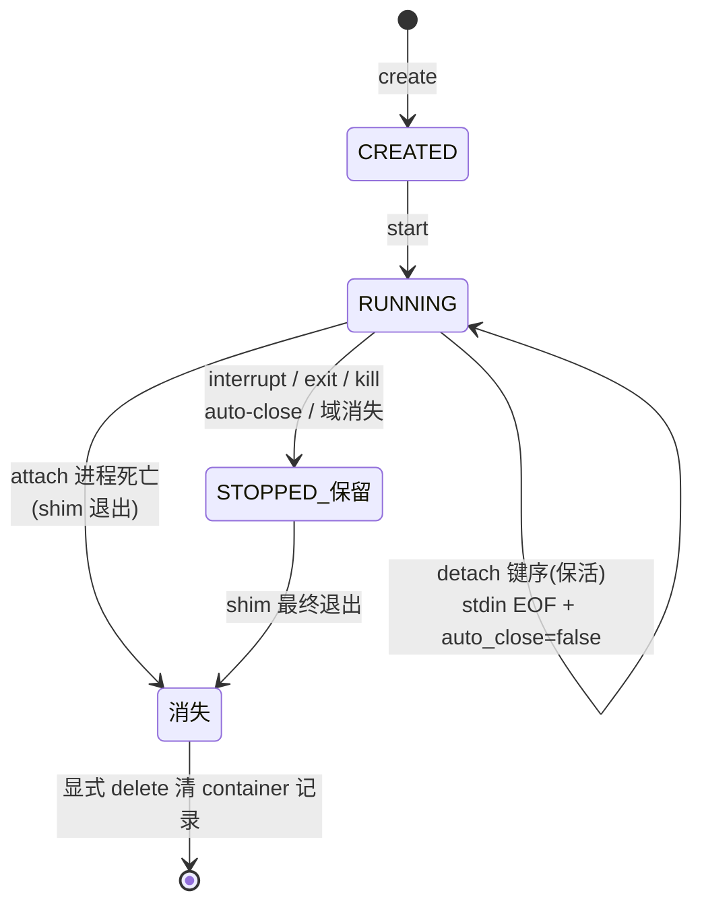

# 容器生命周期与 IO 会话语义（权威口径）

本文件是 MicRun **容器停止、任务记录、attach/detach 与 auto-close 语义的唯一权威口径**。
其他文档（快速入门、注解参考、IO 系统设计、故障排查等）中涉及这些语义的描述一律以本文为准，
并应引导读者回到本文。

写下这份文档的直接原因：issue #47 与 #48 两次把同一类表象误读为缺陷——
`ctr task attach` 之后按 `Ctrl+C`，用户看到 attach 立即退出、随后 `ctr task ls` 看不到任务、
`nerdctl ps -a` 显示 `Created`，于是期望中的 `STOPPED` 从未出现。
这不是缺陷，而是下面几节要讲清楚的语义组合的必然结果。

## 1. 三个核心概念：三层生命周期并不同步

MicRun 里"容器怎么样了"至少要看三层，它们的生死时刻各不相同：

| 层 | 是什么 | 谁创建 | 谁销毁 | 停止后还能看到吗 |
|----|--------|--------|--------|------------------|
| **container 记录** | containerd 里的静态元数据 | `ctr container create` / `nerdctl create` | 显式 `ctr container delete` / `nerdctl rm` | **始终保留**，无 task 时 nerdctl 显示 `Created` |
| **task（任务）** | 运行实例 + 状态（RUNNING/STOPPED…） | task start | 停止路径决定（见 §3） | 视路径：`STOPPED` 保留，或随 shim 退出而消失 |
| **IO 会话** | shim 内的 FIFO ↔ rpmsg tty 数据通路 | task start / attach | detach / 断连 / 停止 | 不可见（只能从行为观察） |

关键推论：**`nerdctl ps -a` 显示的 `Created` 不是容器的新状态**——只是 task 记录消失后，
nerdctl 从 containerd 拿不到 task 信息而回退显示的初始态。判断容器是否真的停止，
看 **Xen 域（`xl list`）与 rpmsg tty（`/dev/ttyRPMSG*`）**，不要看 task 记录。

## 2. attach 客户端的三种"离开"，命运完全不同

这是全部困惑的根源。同一个"用户不再敲键盘"，在字节层面是三件不同的事：

1. **detach 键序（Ctrl+P Ctrl+Q，字节真正送达）**——TTY 容器专属。
   copier 以"保留模式"停止：FIFO 与 rpmsg tty **不关闭**，容器**继续运行**，等下一次 attach。
2. **attach 客户端进程死亡（SIGINT 杀死、关闭终端、SSH 断开、进程被 kill）**——
   stdin 写端与 stdout 读端**同时**消失。容器会在秒级停止（与容器是否 TTY、
   auto_close 设置**无关**），随后 shim 进程退出、task 记录消失。
3. **仅 stdin 结束（客户端进程还活着，只是输入流到了 EOF）**——例如
   `echo help | ctr task attach` 中 echo 结束。TTY 容器走 StdinClosed 停止 IO 会话；
   非 TTY 容器保留会话等待重连，auto-close 到期后回收。

> **"按 Ctrl+C 后 attach 立即退出"是终端行为，不是 MicRun 的 interrupt 生效。**
> 普通终端（canonical 模式）下，tty 驱动把 Ctrl+C 转成 SIGINT 发给前台的 `ctr attach`
> 进程本身，`0x03` 字节**从未到达 MicRun**。这正好属于上面的第 2 类（客户端进程死亡）。
> 想让 Ctrl+C 真正构成 interrupt，需要字节到达 shim：raw 模式终端
> （`nerdctl run -it` 前台天然满足）或直接 `ctr task kill -s INT`。

## 3. 事件 → 结局总矩阵

以下每一行都有 kernel6 QEMU 实测背书（5.10 时代手册口径一致）：

| # | 容器形态 | auto_close | 用户动作 | 容器结局 | task 记录 | shim |
|---|----------|-----------|----------|----------|-----------|------|
| 1 | TTY `-t` | 默认 | Ctrl+C **字节送达**（raw 终端 / `ctr task kill -s INT`） | 立即停止，退出码 130 | **STOPPED 保留** | 驻留 |
| 2 | TTY `-t` | 任意（含 false） | attach 进程死亡（普通终端 Ctrl+C / 关终端 / 断 SSH） | **秒级停止** | 消失 | 退出 |
| 3 | 非 TTY | 任意（含 false） | 同上（attach 进程死亡） | **秒级停止** | 消失 | 退出 |
| 4 | 非 TTY | 默认 | 仅 stdin EOF（客户端存活，如管道 attach 结束、`ctr task start -d` 无人 attach） | 30s 后回收 | 短暂 STOPPED 后消失 | — |
| 5 | 非 TTY | `false` | 仅 stdin EOF | **继续运行**，等待重连 | RUNNING 保留 | 驻留 |
| 6 | TTY `-t` | 任意 | **detach 键序送达**（Ctrl+P Ctrl+Q，raw 终端） | **继续运行** | RUNNING 保留 | 驻留 |
| 7 | TTY `-t` | 默认 | 无人 attach（`start -d`） | 30s 后回收 | 短暂 STOPPED | — |
| 8 | 任意 | 任意 | UniProton shell 内输入 `exit` | 停止，退出码 0 | STOPPED 保留 | 驻留 |
| 9 | 任意 | 任意 | `ctr task kill`（映射信号）/ `nerdctl stop` | 停止，kill 预写退出码 | STOPPED 保留 | 驻留 |
| 10 | 任意 | 任意 | `ctr task delete` / `nerdctl rm` | 停止并删除 | 删除 | 退出（正常清理） |
| 11 | 任意 | 任意 | shim 进程被杀（崩溃） | containerd 判定任务终止并收敛，域被清理 | 消失 | 已死 |
| 12 | 任意 | 任意 | Xen 域被外部销毁（`xl destroy` / 固件崩溃） | 停止（watcher 观测到域消失） | STOPPED | 驻留 |

对矩阵的三个要点：

- **auto-close 的真实语义**：它管的是"**最后一个 stdin 写端消失后** N 秒回收"（第 4/7 行），
  既不是"容器运行时长上限"，也不能阻止第 2/3 行的进程级死亡——后者不走 auto-close 计时。
- **task 记录 STOPPED 保留 vs 消失的分界**：走 MicRun 正常停止路径（interrupt/exit/kill/
  auto-close/域消失）的，task 以 STOPPED 保留一段可观窗口；**attach 客户端进程死亡**与
  **shim 自身死亡**两类会让 shim 退出，containerd 随之移除该 shim 名下全部 task 记录
  （机理见 §5）。两种表现都属正常，判定停止与否请看 Xen 域与 rpmsg tty。
- **抢救窗口**：第 2/3 行的停止在 attach 死亡后约 1 秒内完成，没有"趁容器还没停赶紧重连"的窗口。

## 4. 状态与事件流图

```mermaid
flowchart TB
    subgraph client["attach 客户端"]
        KEY["键盘输入<br/>Ctrl+C=0x03 / Ctrl+P Ctrl+Q"]
        TERM["终端(tty)"]
        PROC["ctr attach 进程"]
    end

    TERM -- "canonical 模式: ISIG 拦截 0x03<br/>转 SIGINT 杀死前台进程" --> PROC
    TERM -- "raw 模式: 字节原样透传" --> FIFO
    PROC -- "stdin 写端 + stdout 读端" --> FIFO

    subgraph shim["MicRun shim"]
        FIFO["stdin/stdout FIFO"]
        COP["copier / console 解释器"]
        POLICY["事件策略<br/>Interrupt→停止(130)<br/>Detach→保活分离"]
        WATCH["lifecycle watcher<br/>auto-close 计时 / 域存活观测"]
        TASKREC["task 记录"]
        SHIMPROC["shim 进程"]
    end

    FIFO --> COP --> KEY2{"字节解释"}
    KEY2 -- "0x03 (Interrupt)" --> POLICY -->|立即| STOP1["容器 STOPPED(130)<br/>task 保留 / shim 驻留"]
    KEY2 -- "Ctrl+P Ctrl+Q (Detach)" --> POLICY -->|保留模式| RUN["容器继续运行<br/>等 reattach"]
    PROC -- "进程死亡" --> EOF["stdin EOF + stdout 无读者"]
    EOF --> SESS["IO 会话终止<br/>rpmsg tty 关闭"] --> STOP2["容器秒级停止<br/>shim 退出 / task 消失"]
    WATCH -- "stdin 写端消失 + auto_close" -->|N 秒| STOP3["容器回收"]
```



（task 状态机内部实现层面的转移表见 [任务状态机](../internals/task-state-machine.md)，
本图是用户可见行为的投影。）

## 5. task 记录为何消失：shim 退出机理

先说结论：**MicRun shim 自己从不因为"容器停止"而退出**。容器退出后 shim 按设计驻留，
等待 Delete RPC 收尾（`internal/transport/shimv2/events.go` 的注释原文即
"Main container exited naturally, **keeping shim running for cleanup**"）。
shim 的唯一正常退出开关是 **containerd 侧的 Delete → Shutdown 序列**：

1. containerd 向 shim 发 **Delete RPC**；micrun 处理 Delete 时把 task 从内存注册表移除
   （`internal/application/task/service_delete.go`），并发布 TaskExit/TaskDelete 事件；
2. Delete 完成、注册表已空且非 CRI sandbox 场景时，containerd 紧接着发 **Shutdown RPC**
   （containerd `runtime/v2/shim.go` 的 shimTask.delete：`if !sandboxed { waitShutdown }`，
   3 秒超时）；
3. shim 执行 Shutdown 退出；containerd 检测连接断开（"shim disconnected"）后还会做一轮
   兜底清理（"cleaning up after shim disconnected"，一次性 delete），把 task 记录从
   containerd 侧彻底移除。

因此各路径的差异只在于**这一对 RPC 是否有人发起**：

- **Interrupt / exit / kill / auto-close / 域消失**：前台 ctr 客户端在 Wait 返回后直接退出、
  不调 Delete（CRI 场景则因 sandbox 语义跳过 Shutdown）——没有人发 Delete → shim 驻留 →
  task 以 STOPPED 留在 `ctr task ls`。
- **attach 客户端进程死亡**：容器停止后，Delete→Shutdown 收尾链在亚秒级被发起
  （kernel6 实测日志链：容器停止 → 网络清理 → `failed to publish /tasks/delete: shutdown`
  → `shim disconnected` → 一次性 delete 清记录），shim 退出、task 记录随之消失。
- **shim 自身被杀/崩溃**：containerd 的 disconnected 清理链兜底（补一次性 delete 与
  137 退出码），task 记录同样被移除。

一句话：**`ctr task ls` 里 STOPPED 保留还是消失，取决于 Delete→Shutdown 收尾链有没有被
触发，而不是容器停止本身**。两种表现都是正常收尾，判断容器生死请回到 Xen 域与 rpmsg tty。

## 6. 正确姿势清单

- **想离开但容器继续跑**：TTY 容器用 detach 键序（需 raw 终端，`nerdctl run -it` / `nerdctl attach`
  满足；`ctr task attach` 在普通终端下按键到不了 shim），或创建时 `auto_close=false` 后直接关掉
  非交互式 attach（仅 stdin 结束一类）。
- **想停止容器**：`nerdctl stop` / `ctr task kill -s INT`（远程、可靠、退出码 130），
  或 RTOS shell 内 `exit`；TTY + raw 终端下 Ctrl+C 也可以。
- **管道喂命令**：`printf 'help\n' | ...` 形态命令发完 stdin 即 EOF，容器按 auto-close 策略
  在 N 秒后回收——需要它活着的请设 `auto_close=false` 或保持 stdin 写端。
- **判断容器是否停止**：`xl list`（域消失）与 `/dev/ttyRPMSG*`（tty 回收）为准；
  `ctr task ls` 的 STOPPED/消失皆正常，`nerdctl ps -a` 的 `Created` 只是 task 记录不在的回退显示。
- **脚本中创建 TTY 容器**：`ctr run -t` 要求 ctr 自身 stdin 是终端，无终端环境会 panic——
  用 `ssh -tt`、tmux 或改用 nerdctl。

## 7. 常见误解纠正

| 误解 | 事实 |
|------|------|
| "Ctrl+C 后容器应该显示 STOPPED" | 普通终端下 Ctrl+C 只杀死了 attach 进程（终端 ISIG 行为），容器随后停止且 task 记录消失（§3 第 2/3 行）；STOPPED(130) 只在字节真正送达时出现（§3 第 1 行） |
| "auto_close=false 能保住容器" | 只对"仅 stdin 结束"有效；attach 进程死亡会直接停止容器，与 auto_close 无关 |
| "attach 退出了说明 interrupt 生效了" | attach 立即退出是终端把 Ctrl+C 转成了 SIGINT，与 MicRun 无关 |
| "非 TTY 容器按 Ctrl+P Ctrl+Q / Ctrl+C 没反应是 bug" | 非 TTY 输入按数据流处理，无键序语义（与 docker 一致） |
| "nerdctl 显示 Created 说明容器没停" | Created 是 task 记录消失后的回退显示；停没停看 Xen 域 |
| "task 从列表消失是被删除了/泄漏了" | 停止路径决定可见性（§3），两种表现皆正常 |
